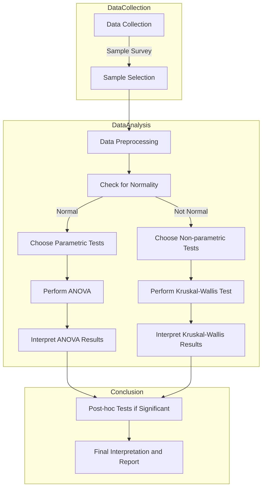

 

## Headings

```
# Heading 1
## Heading 2
### Heading 3
#### Heading 4
##### Heading 5
###### Heading 6
```

# Heading 1
## Heading 2
### Heading 3
#### Heading 4
##### Heading 5
###### Heading 6


## Emphasis
```
*Italic text* or _italic text_
**Bold text** or __bold text__
~~Strikethrough text~~

```

*Italic text* or _italic text_
**Bold text** or __bold text__
~~Strikethrough text~~


## Lists

### Unordered List
```
- Item 1
- Item 2
  - Subitem 2.1
  - Subitem 2.2

```
- Item 1
- Item 2
  - Subitem 2.1
  - Subitem 2.2

### Ordered List
```
1. First item
2. Second item
   1. Subitem A
   2. Subitem B


```
1. First item
2. Second item
   1. Subitem A
   2. Subitem B


## Links and Images

[Link to Google](https://www.google.com)


## Blockquotes

> Markdown is a lightweight markup language with plain-text formatting syntax.

## Code Blocks

### Inline Code

Use backticks to highlight `code snippets`.

### Fenced Code Blocks

```python
import numpy as np

# Set the seed for reproducibility (optional)
np.random.seed(0)

# Generate 1000 data points from a standard normal distribution
data = np.random.randn(1000)

# Print the first 10 data points as an example
print(data[:10])

```

## Tables

| Name  | Age | City         |
|-------|-----|--------------|
| John  | 28  | New York     |
| Jane  | 25  | Los Angeles  |


 

## Footnotes
```
Here is a footnote[^1].

[^1]: Footnote content goes here.

```
Here is a footnote[^1].

[^1]: Footnote content goes here.

## Task Lists
```
- [x] Write Markdown examples
- [ ] Review and edit content
- [ ] Publish the document

```
- [x] Write Markdown examples
- [ ] Review and edit content
- [ ] Publish the document

## Math Formulas
 

### Inline Math

Inline math expressions are enclosed within single dollar signs (\$):

The Pythagorean theorem states that $ a^2 + b^2 = c^2 $.
### Display Math

Display math expressions are enclosed within double dollar signs (\$\$):

$$
\sum_{n=1}^{k} n^2 = \frac{k(k+1)(2k+1)}{6}
$$

 

### Matrix
 

$$
\begin{pmatrix}
a & b & c \\
d & e & f \\
g & h & i
\end{pmatrix}
$$

 

$$
A = \begin{pmatrix}
\begin{array}{c|ccc}
2 & 3 & 4 & 5 & 6 \\
7 & 8 & 9 & 10 & 11 \\
\hline
1 & 2 & 3 & 4 & 5 \\
6 & 7 & 8 & 9 & 10 \\
\end{array}
\end{pmatrix}
$$


$$
A = \left[
\begin{array}{cccc}
1 & 2 & 3 & 4 \\
5 & 6 & 7 & 8 \\
9 & 10 & 11 & 12 \\
\end{array}
\right]
$$

$$
\begin{array}{c|cccc}
    & \text{Column 1} & \text{Column 2} & \text{Column 3} & \text{Column 4} \\
\hline
\text{Row 1} & 1 & 2 & 3 & 4 \\
\text{Row 2} & 5 & 6 & 7 & 8 \\
\text{Row 3} & 9 & 10 & 11 & 12 \\
\end{array}
$$


### Equation 
 
$$
f(x;k) = \frac{1}{2^{k/2} \Gamma(k/2)} x^{(k/2) - 1} e^{-x/2}, \quad x \geq 0
$$


$$
\int_{0}^{1} x^2 \, dx = \frac{1}{3} \tag{1} \label{eq:integral}
$$ 

Equation $ \ref{eq:integral} $ shows the evaluated integral.


$$
\begin{aligned}
    (x + y)^2 &= x^2 + 2xy + y^2 \\
              &= x^2 + y^2 + 2xy
\end{aligned}
\tag{a}
$$

Equation (a) shows the expansion of $ (x + y)^2 $

## Flow Chart

## Horizontal Rule

```
---
```
---