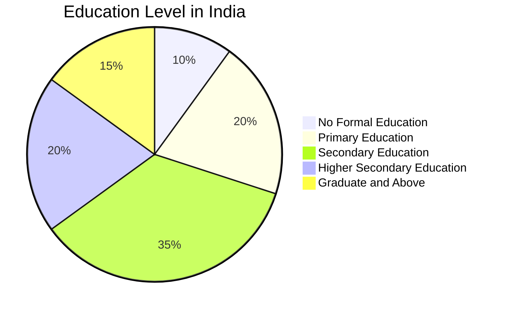
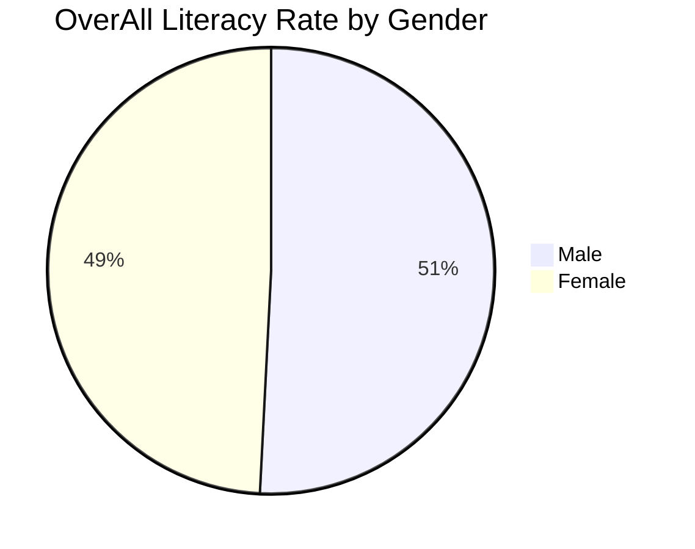

Statistical Analysis on Indian Male-Female Literacy Using 2011 Census Data.

In this project, we made a comparision in literacy in India, focusing on gender disparities, using data from the 2011 census. Utilizing R programming, we employ descriptive statistics and analytical tools to understand and quantify the literacy rates among males and females across different regions of India.

## Data Source

<https://www.kaggle.com/datasets/danofer/india-census?select=india-districts-census-2011.csv>
<https://www.indiastat.com/data/demographics/density/data-year/all-years>

## Objectives

### I. Comparison of Literacy Rates

- Compare literacy rates of different states and union territories with the national average.
- Compare literacy rates for males and females in different states and union territories with the national average.

### II. Analysis of Gender Disparities

- Determine significant differences in literacy rates between males and females.
- Assess the variability in literacy rates between males and females to determine significance.

### III. Examination of Socio-Religious Factors

- Test hypotheses to identify significant differences in literacy rates among two-way classified religious groups and locations (rural, urban).
- Conduct hypothesis testing to compare literacy rates among different religious groups and between urban and rural populations within various states.




```mermaid
flowchart TD
    A[Descriptive Statistics] --> B[Education in Different States]
    A --> C[Comparison of Male and Female Literacy]
    A --> D[National Average Literacy]
    A --> E[Comparison with National Average]
    A --> F[Statistical Analysis]
    F --> G[Normality Check (Shapiro-Wilk Test)]
    F --> H[One-way ANOVA]
    F --> I[Two-way ANOVA (One Observation per Cell)]

```




## Project files

- [project repo](https://github.com/mrinalcs/india-literacy)
- [final project](https://drive.google.com/drive/folders/1DgPTm5jvRlimD80-HjIT6CK9elssA9zO)
