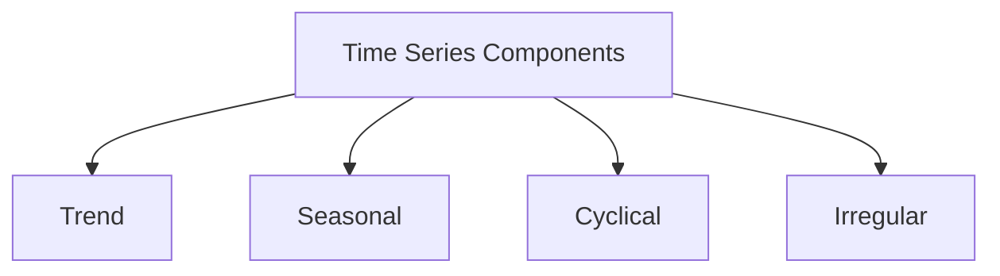

## Introduction to Time Series Analysis


A Time series is a set of observations, each one being recorded at a specific time.

### Discrete and Continuous time series
It is theoretical Concept. Discrete time series consists of data points separated by time intervals that are greater than one second.A continuous time series contains one data point usually measured per second.

### Stationarity

Stationarity means that the statistical properties (usually mean, variance, covariance) of a time series (or rather the process generating it) do not change over time. Unless a time series is stationary it is not ready for further analysis as well as future prediction is not possible

### Time Series Components 




- **Trend**  the general tendency of data to increase or decrease or constant during a long period of time.
- **Seasonal** the rhythmic forces which occurs periodically with spans less than a year. It can be recorded quarterly, monthly,weekly,daily even hourly. 
- **Cyclical**  oscillatory movement with period of oscillation more than one year.
- **Irregular** unsystematic, unexplained random or irregular fluctuation.
 

Any time series is composed of any combinations of these four components:
- $ T_t $: Secular Trend.
- $ S_t $: Seasonality.
- $ C_t $: Cyclical Component.
- $ I_t $: Irregular component.

Mathematically, a time series $ Y_t $ can be expressed as:

$$ Y_t = f(T_t, S_t, C_t, I_t) $$

In the classical approach, the function $ f $ can be either simple multiplicative or simple additive.


## Getting Started with R

To perform time series analysis in R, you need to have R and RStudio installed on your machine. You can download them from the following links:

1. [Download and Install R](https://cran.rstudio.com/)
2. [RStudio Desktop](https://posit.co/download/rstudio-desktop/)
 
Once installed, open RStudio and install the necessary packages by running:

Or, you can R Studio online [Posit Cloud](https://posit.cloud/)

```R 
install.packages("forecast")
install.packages("tseries")
install.packages("ggplot2")

```

## Importing and Exploring Time Series Data

###  Data in form of  R vector

```R
# Define the temperature data points as a vector
temperature <- c(25.3, 26.1, 27.5, 28.3, 29.6, 30.2, 31.4, 32.5, 31.2, 29.8, 28.4, 26.9)

# Convert it to a time series object
ts_data <- ts(temperature, start = c(2012, 1), frequency = 12)

# Plot the time series
plot(ts_data, main = "Temperature Time Series", ylab = "Temperature (°C)", xlab = "Time")


```

Here `frequency = 12` means permonth data points , similarly -

| Frequency Value | Refers to                           |
|-----------------|---------------------------------------|
| 1               | Annual data (one data point per year)  |
| 4               | Quarterly data (one data point per quarter) |
| 12              | Monthly data (one data point per month) |


*Temperature Time Series Plot*

### Example AirPassengers dataset

Let's start by importing a time series dataset. We'll use the `AirPassengers` dataset, which contains monthly totals of international airline passengers from 1949 to 1960.


```r
# Load the dataset
data("AirPassengers")

# Convert the dataset to a time series object
ts_data <- ts(AirPassengers, start = c(1949, 1), frequency = 12)

# Plot the time series
plot(ts_data, main = "AirPassengers Time Series", ylab = "Passengers", xlab = "Time")

```


*R Studio*
 
## Time Series Decomposition

Decomposing a time series involves breaking it down into its fundamental components: trend, seasonality, and residuals.

```R 
# Decompose the time series
decomposed <- decompose(ts_data)

# Plot the decomposed components
plot(decomposed)

```

In your case, if you are using a time series `ts_data` with monthly frequency (frequency = 12), you need at least 24 observations (2 years) to decompose the series properly to avoid `Error in decompose(ts_data) : time series has no or less than 2 periods`.  


*Decomposition of additive time series for AirPassengers Dataset*

## Stationarity and Differencing
 
A stationary time series has constant mean and variance over time. Most time series models assume the series is stationary. To check for stationarity, we can use the **Augmented Dickey-Fuller test**.


*To avoid Error in adf.test(ts_data) : could not find function "adf.test" Check tseries pacage*


### Output

```R
> # Perform the Augmented Dickey-Fuller test
> adf.test(ts_data)

	Augmented Dickey-Fuller Test

data:  ts_data
Dickey-Fuller = -7.3186, Lag order = 5, p-value = 0.01
alternative hypothesis: stationary

Warning message:
In adf.test(ts_data) : p-value smaller than printed p-value

```

**Hypothesis:**
- $ H_0 $: The time series data is non-stationary.
- $ H_1 $: The time series data is stationary.

**Conclusion:**

The time series data is stationary. ($ \alpha = 0.05 > \text{p-value} $)


*Differenced AirPassengers Time Series Plot*

## Autocorrelation and Partial Autocorrelation

Autocorrelation Function (ACF) and Partial Autocorrelation Function (PACF) are used to identify the order of autoregressive (AR) and moving average (MA) components in an ARIMA model.

```R 
# Plot ACF and PACF
acf(ts_data, main = "ACF of AirPassengers")
pacf(ts_data, main = "PACF of AirPassengers")

```


*ACF of AirPassengers Dataset*


*PACF of AirPassengers Dataset*

## Time Series Modeling: ARIMA

```R
> library(forecast)
> # Fit an ARIMA model
> fit <- auto.arima(ts_data)
> 
> # Summary of the model
> summary(fit)
Series: ts_data 
ARIMA(2,1,1)(0,1,0)[12] 

Coefficients:
         ar1     ar2      ma1
      0.5960  0.2143  -0.9819
s.e.  0.0888  0.0880   0.0292

sigma^2 = 132.3:  log likelihood = -504.92
AIC=1017.85   AICc=1018.17   BIC=1029.35

Training set error measures:
                   ME     RMSE     MAE       MPE     MAPE     MASE         ACF1
Training set 1.342299 10.84619 7.86754 0.4206976 2.800458 0.245628 -0.001248475
> 

```

## Forecasting

Now we'll evaluate its performance and use it for forecasting.

```R 
# Forecast the future values
forecasted <- forecast(fit, h = 24)

# Plot the forecast
plot(forecasted, main = "AirPassengers Forecast")

```


*Forecast 24 time pointS*


## References

- [a Little Book of R for Time Series!](https://a-little-book-of-r-for-time-series.readthedocs.io/en/latest/src/timeseries.html)

- [Tutorialspoint](https://www.tutorialspoint.com/r/r_time_series_analysis.htm)
- [Introduction to time series a detailed discussion](https://vbstat.github.io/note/time-series-analysis/lecture1%20Introduction%20to%20time%20series-a%20detailed%20discussion.pdf)
- [R Codes](https://gist.githubusercontent.com/mrinalcs/c5233649f11ca11f1aa89a2c008e89b4/raw/afab5fbbad7455c07af8258815ac7f18d6c6bd07/script.r)