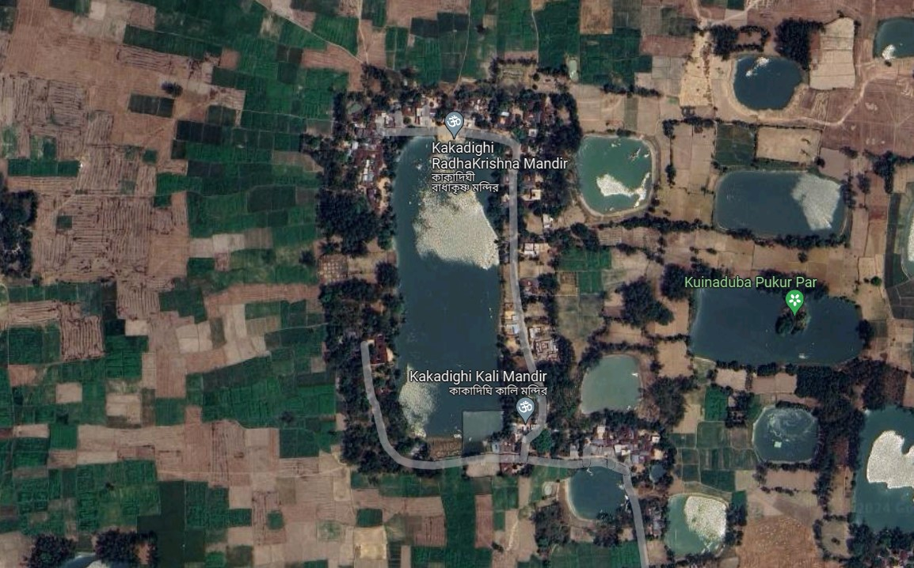
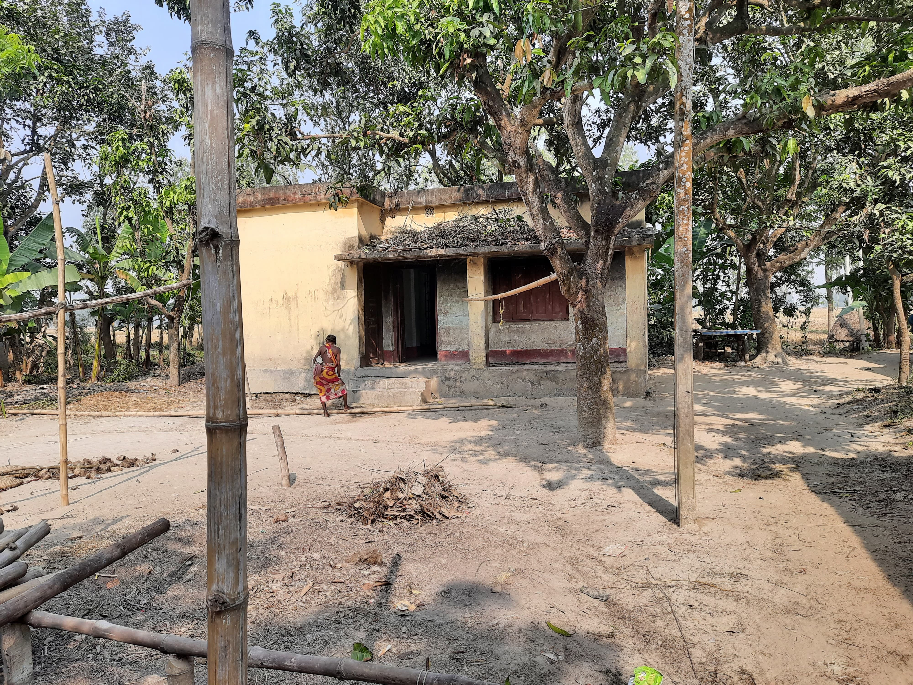
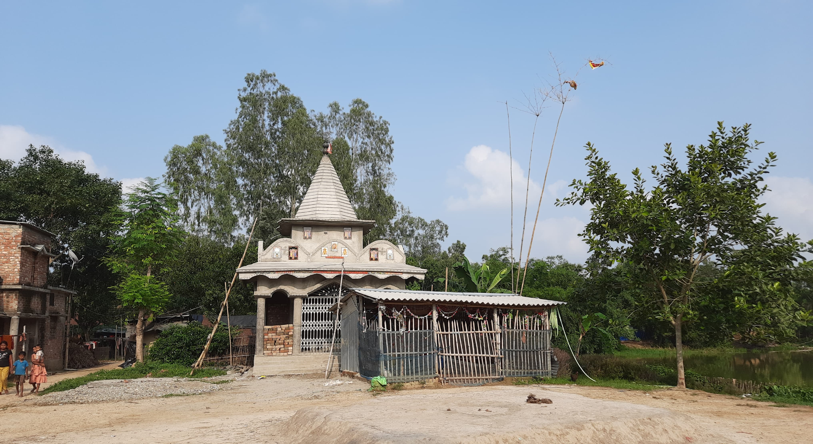
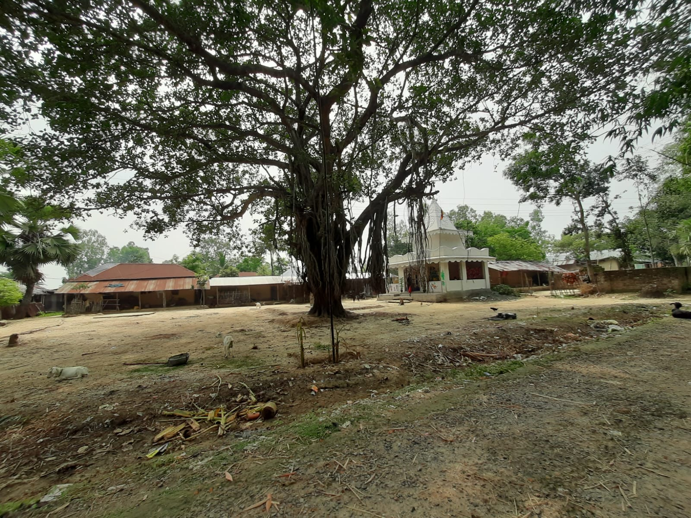

 

| বিবরণ (Detail)               | তথ্য (Information)                                 |
|------------------------------|----------------------------------------------------|
| গ্রামের নাম (Village Name)   | কাকাদিঘি (Kakadighi)                               |
| মৌজা (Mouja)                 | চেউটি মহেশপুর (Cheuti Mahespur)                   |
| পিন কোড (PIN Code)           | ৭৩৩১২৫ (733125)                                    |
| পোস্ট অফিস (Post Office)     | বৈরহাট্টা (Bairhatta)                               |
| থানা (Police Station)        | হরিরামপুর (Harirampur)                             |
| জেলা (District)              | দক্ষিণ দিনাজপুর (Dakshin Dinajpur)                 |
| রাজ্য (State)                | পশ্চিমবঙ্গ (West Bengal)                            |
| দেশ (Country)                | ভারত (India)                                        |

 

*Google map Satellite view: Kakadighi*

The village is name after the pond Kakadighi . Its about 330.36 meter long pond. Houses of this village are around the pond. 

There is a health center in the village. Nearest Primary and high school is [Kasba FP School](https://maps.app.goo.gl/NhwAszQeHD8itG1XA) and [Kasba Bairhatta High School](https://maps.app.goo.gl/UaYDdvHwtdBdfizD9). 
 
Farming is the main occupation of people.Fishing is done as subsidiary job also.

*Kakadighi Health Center*

There are few templaes in the village. 

*কাকাদিঘী রাধাকৃষ্ণ মন্দির [Kakadighi RadhaKrishna Mandir](https://maps.app.goo.gl/NmTG5x8ca8PnN1U6A)*
 

Its famous for a big Banyan tree. Here every  every year Gambhira puja is celebrates in the month of Vaishak. Celebrated the whole day with kirtan around the banyan tree. Earlier Charak puja was part of it but not now.

*Gambhiratola: কাকাদিঘি কালি মন্দির [Kakadighi Kali Mandir](https://maps.app.goo.gl/XnvgQdwZ8JuKMHpE6)*
 

