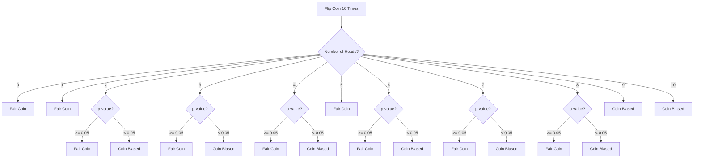

The p-value tells how likely it is that your results happened by chance. So p-value is the probability of observing data at least as extreme as what you have, assuming that the null hypothesis is true.

It helps you decide whether to reject the null hypothesis. A small p-value indicates that the observed data is unlikely under the null hypothesis, suggesting that the alternative hypothesis might be true.

## Example

For example you want to test if a coin is fair (meaning it has an equal chance of landing on heads or tails).

- **Null Hypothesis (H0)**: The coin is fair (p = 0.5).
- **Alternative Hypothesis (H1)**: The coin is not fair (p ≠ 0.5).

p = probability of getting head 

**Experiment:** You toss the coin 10 times and record the results. Let's say you get 8 heads and 2 tails.

Here p-value is if the coin is fair, how likely is it that you would get 8 or more heads out of 10 flips?

If the p-value is high (e.g., p = 0.6), it means getting 8 heads is quite likely, even with a fair coin. Therefore, you don’t reject the null hypothesis, and the coin is likely fair.

If the p-value is small (e.g., p = 0.03), it means that getting 8 heads is very unlikely if the coin is fair. Therefore, you reject the null hypothesis and conclude the coin might be biased.

## Why α = 0.05?

0.05 level of significance (α) was popularized by statisticians like Ronald Fisher in the early 20th century. It was chosen as a balance between being stringent enough to reduce the chance of false positives (Type I errors) while still allowing researchers to find statistically significant results.

If you set α = 0.05, you're allowing a 5% chance of incorrectly rejecting the null hypothesis when it is actually true. In clinical trials, a lower α (like 0.01) might be used to reduce the risk of falsely concluding a treatment is effective.

##  Why rejecting or failing to reject the null hypothesis ?

When you reject the null hypothesis, it suggests that there is sufficient evidence to support the alternative hypothesis, indicating a statistically significant difference or effect. However, It means the data you collected provides strong evidence against the null hypothesis.

Conversely, if you fail to reject the null hypothesis, it does not mean that the null hypothesis is true; instead, it suggests that there is not enough evidence to support the alternative hypothesis. In other words, failing to reject the null simply implies that any observed differences could be due to random chance, rather than a true effect. Thats whay we say failed to reject null hypothesis, not ~~Accept the null hypothesis~~ .