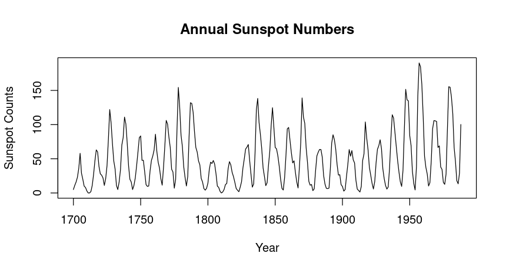
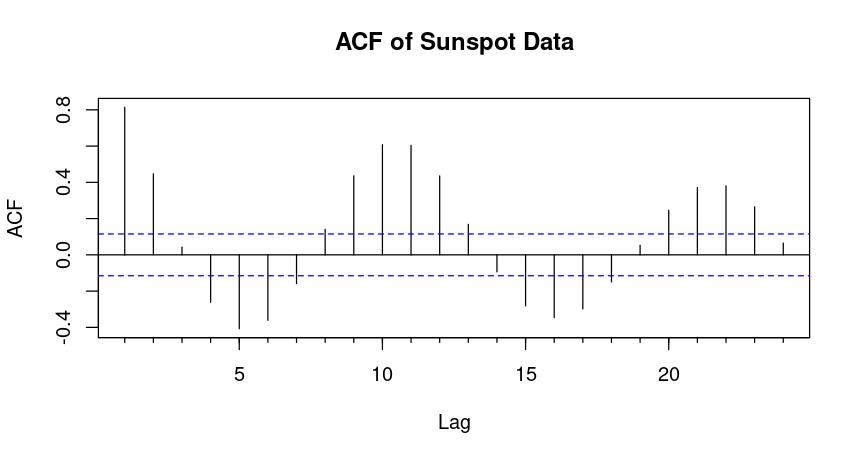
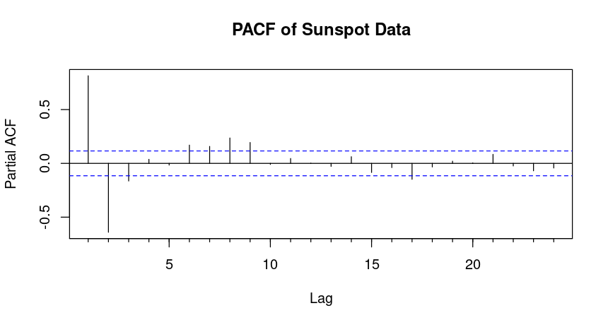
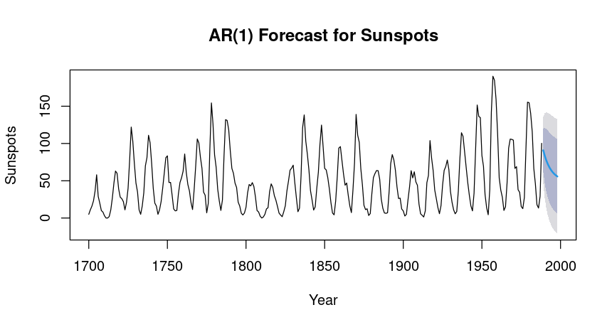

An Autoregressive (AR) model is one of the simplest time series forecasting methods. In this model, the future value of a variable is assumed to be a linear function of past values. An AR model of order p is denoted as AR(p), meaning the next observation depends on the previous p observations.

$$ y_t = c + \phi_1 y_{t-1} + \phi_2 y_{t-2} + \cdots + \phi_p y_{t-p} + \epsilon_t $$

- $y_t$ is the value at time $t$
- $\phi_1, \phi_2, \dots \phi_p$ are the coefficients
- $\epsilon_t$ is the error term


## Stationarity Check
For fitting an AR model, we need to ensure the series is stationary. A stationary time series doesn’t show trends or seasonality, and its autocorrelation decays quickly over time. If not we can take  lagged and iterated difference of the data and if stationary proceed further analysis.
 

**Augmented Dickey-Fuller (ADF)** test helps confirm whether a series is stationary.

If the p-value from the test is less than 0.05, the series is stationary, and you can proceed with fitting an AR model. 


## Choosing Order(p) of the AR Model
The AR model order, denoted as AR(p), represents the number of past values to include in the model. Choosing the correct order is crucial for good forecasting.


### ACF (Autocorrelation Function): 
Helps determine the correlation between observations at different time lags. In an AR model, the ACF decay exponentially or follow an oscillating pattern.

### PACF (Partial Autocorrelation Function): 
Shows the direct correlation between the time series and its lagged values after removing the effect of intermediate lags. For an AR(p) model, the PACF typically cuts off after lag p.


If the PACF cuts off sharply after lag 2, an AR(2) model might be appropriate.


### Akaike Information Criterion (AIC)
Another method to select the AR order is using the Akaike Information Criterion (AIC), which measures the goodness of fit while penalizing complexity. Lower AIC values indicate better models.

By comparing the AIC values, you can select the model with the lowest AIC, which gives the best balance between goodness of fit and model complexity.

## Fit the AR Model
Once we've determined the correct order p, we can fit the AR model in R using the `ar()` function, specifying order = c(p, 0, 0).

## Forecast
After fitting the model, we can forecast future values using the `forecast` function from the forecast package.


## Example

One stationary dataset is the `sunspot.year` dataset, which records the annual number of sunspots observed over time. 



*Annual Sunspot Numbers from 1700 to 1988*

From  visual inspection we can say this is a stationary time series data

```output
	Augmented Dickey-Fuller Test

data:  sunspot.year
Dickey-Fuller = -4.7561, Lag order = 6, p-value = 0.01
alternative hypothesis: stationary
```


Since the test statistic is significantly negative and the p-value is low, you can conclude that `sunspot.year` time series is stationary, so its statistical properties as mean and variance don't change over time.


*The ACF follow an oscillating pattern*


*The PACF shows a significant spike at lag 1*

Since the PACF has a strong spike at lag 1 and no significant spikes after that, this suggests that the data is best modeled by an AR(1) model.

```r
# Fit an AR(1) model
fit_ar1 <- arima(sunspot.year, order = c(1, 0, 0))  # AR(1) model

# Print the model summary
summary(fit_ar1)
```

```output
> summary(fit_ar1)

Call:
arima(x = sunspot.year, order = c(1, 0, 0))

Coefficients:
         ar1  intercept
      0.8196    48.6986
s.e.  0.0337     7.2722

sigma^2 estimated as 513:  log likelihood = -1312.36,  aic = 2630.71

Training set error measures:
                   ME     RMSE      MAE  MPE MAPE      MASE      ACF1
Training set 0.195281 22.65002 17.22751 -Inf  Inf 0.9605674 0.5492564 
```

The ARIMA(1, 0, 0) model fitted to the `sunspot.year` data shows a reasonably *strong autocorrelation*, indicated by the AR(1) coefficient of **0.8196**. However, the error metrics suggest some limitations:

**High RMSE (22.65) and MAE (17.23)** indicate that while the model captures some patterns, there may be substantial forecast errors.
The **infinite values for MPE and MAPE** indicate potential issues with the data.


```r
# Forecast 10 points (years)
forecast_ar1 <- forecast(fit_ar1, h = 10)

# Plot the forecasts
plot(forecast_ar1, main = "AR(1) Forecast for Sunspots", ylab = "Sunspots", xlab = "Year")

# Print the forecasted values
print(forecast_ar1)
```


*Forecast for Sunspots for 10 years*

```output
> print(forecast_ar1)
     Point Forecast     Lo 80    Hi 80      Lo 95    Hi 95
1989       90.90925 61.882084 119.9364  46.516031 135.3025
1990       83.29453 45.763547 120.8255  25.895845 140.6932
1991       77.05349 34.759489 119.3475  12.370397 141.7366
1992       71.93832 26.725645 117.1510   2.791499 141.0851
1993       67.74592 20.674136 114.8177  -4.244162 139.7360
1994       64.30982 16.029364 112.5903  -9.528766 138.1484
1995       61.49359 12.417920 110.5693 -13.561169 136.5483
1996       59.18539  9.582706 108.7881 -16.675372 135.0462
1997       57.29360  7.340003 107.2472 -19.103832 133.6910
1998       55.74308  5.555140 105.9310 -21.012747 132.4989
```


Overall, the forecasts indicate a downward trend in sunspot activity over the next decade, with increasing uncertainty as we move further into the future. 


## Conclusion
The Autoregressive (AR) model is a fundamental approach for time series forecasting, relying on the assumption that future values depend linearly on past observations. To use an AR model, we must ensure the time series is stationary and then identify the appropriate order using tools like the PACF plot or AIC criterion.