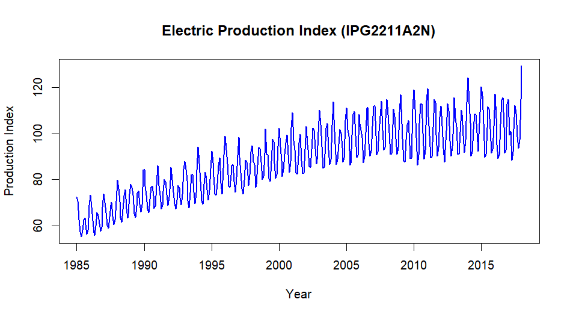
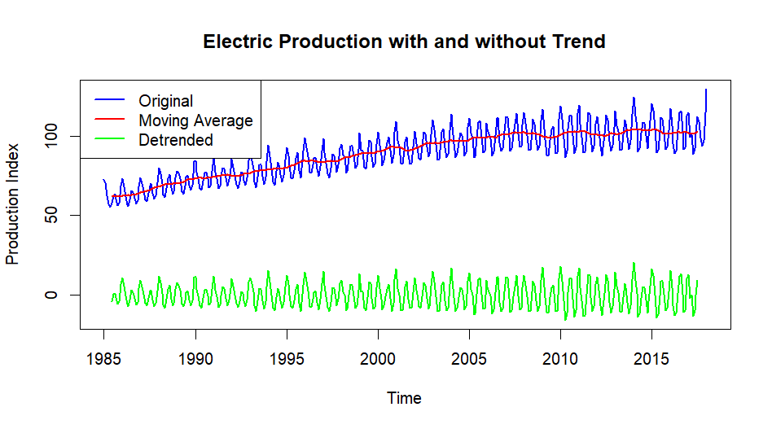

The dataset **Electric_Production** contains time series data spans from *January 1985 to January 2018* related to electricity production in the U.S., as represented by the Industrial Production Index (IPI) for the Electric Power sector. It consists of two columns:

**DATE:** This column contains dates in a month/day/year format (e.g., 1/1/1985). It represents the time period corresponding to the monthly measurements of electricity production.

**IPG2211A2N:** Numeric values of the Industrial Production Index for electric power generation, transmission, and distribution. The values indicate the output levels of electricity production over time, with a base level of 100 typically representing a standard or reference period. The values in this dataset reflect monthly changes in electricity production, with higher values indicating greater production levels.
 
Data Source : <https://www.kaggle.com/datasets/shenba/time-series-datasets?select=Electric_Production.csv>

## Exploratory Data Analysis



By looking at the above plot we can see, there is an upward trend over the period of time.


```output
 summary(Electric_Production$IPG2211A2N)
   Min. 1st Qu.  Median    Mean 3rd Qu.    Max. 
  55.32   77.11   89.78   88.85  100.52  129.40 
 ``` 

The minimum production recorded is 55.32, while the maximum is 129.40, indicating a significant range of variability. The first quartile (77.11) and third quartile (100.52) show that 25% of values are below 77.11 and 75% are below 100.52, respectively. The median production level is 89.78, and the mean is 88.85, suggesting a fairly symmetrical distribution.  


## Check for Stationarity

Augmented Dickey-Fuller Test

Null Hypothesis: Time Series is non-stationary.

```output
	Augmented Dickey-Fuller Test

data:  Electric_Production_TS
Dickey-Fuller = -5.139, Lag order = 7, p-value = 0.01
alternative hypothesis: stationary
```

The p-value of 0.01 is less than the common significance level of 0.05. This indicates that we can reject the null hypothesis.This implies that the time series is stationary.

<!-- ## Transform the Data

 -->


## Model Selection
## Forecasting