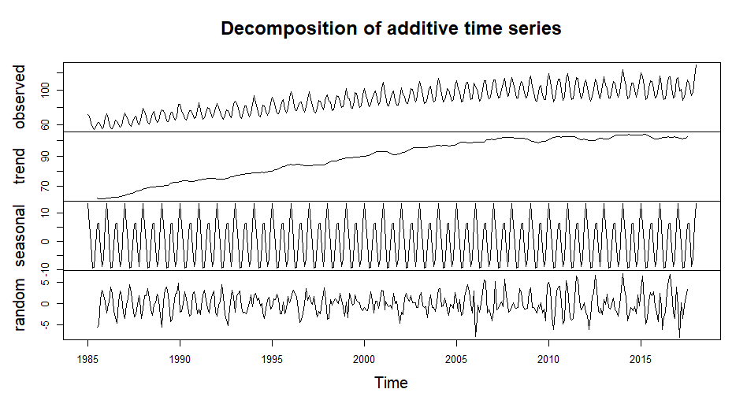

The dataset **Electric_Production** contains time series data spans from *January 1985 to January 2018* related to electricity production in the U.S., as represented by the Industrial Production Index (IPI) for the Electric Power sector. It consists of two columns:

**DATE:** This column contains dates in a month/day/year format (e.g., 1/1/1985). It represents the time period corresponding to the monthly measurements of electricity production.

**IPG2211A2N:** Numeric values of the Industrial Production Index for electric power generation, transmission, and distribution. The values indicate the output levels of electricity production over time, with a base level of 100 typically representing a standard or reference period. The values in this dataset reflect monthly changes in electricity production, with higher values indicating greater production levels.
 
Data Source : <https://www.kaggle.com/datasets/shenba/time-series-datasets?select=Electric_Production.csv>

## Exploratory Data Analysis


By looking at the above plot we can see, there is an upward trend over the period of time.


```output
 summary(Electric_Production$IPG2211A2N)
   Min. 1st Qu.  Median    Mean 3rd Qu.    Max. 
  55.32   77.11   89.78   88.85  100.52  129.40 
 ``` 

The minimum production recorded is 55.32, while the maximum is 129.40, indicating a significant range of variability. The first quartile (77.11) and third quartile (100.52) show that 25% of values are below 77.11 and 75% are below 100.52, respectively. The median production level is 89.78, and the mean is 88.85, suggesting a fairly symmetrical distribution.  




## Check for Stationarity

Augmented Dickey-Fuller Test

Null Hypothesis: Time Series is non-stationary.

```output
	Augmented Dickey-Fuller Test

data:  Electric_Production_TS
Dickey-Fuller = -5.139, Lag order = 7, p-value = 0.01
alternative hypothesis: stationary
```

The p-value of 0.01 is less than the common significance level of 0.05. This indicates that we can reject the null hypothesis.This implies that the time series is stationary.


from above plot of difference data  we can it better stationary.

<!-- ## Transform the Data

 -->


## Model Selection


```output
Call:
arima(x = Electric_Production_TS, order = c(10, 0, 0))

Coefficients:
         ar1      ar2      ar3      ar4     ar5     ar6     ar7      ar8      ar9    ar10
      0.8893  -0.2684  -0.0491  -0.0294  0.2108  0.0918  0.1189  -0.1810  -0.1400  0.3527
s.e.  0.0474   0.0646   0.0654   0.0651  0.0646  0.0648  0.0649   0.0651   0.0644  0.0475
      intercept
        86.1337
s.e.    17.9707

sigma^2 estimated as 12.41:  log likelihood = -1067.66,  aic = 2159.31

Training set error measures:
                   ME     RMSE      MAE       MPE     MAPE      MASE       ACF1
Training set 0.352722 3.522736 2.596595 0.2713289 2.865757 0.3942434 -0.1616198
```

```output
	Augmented Dickey-Fuller Test

data:  ar10_model$residuals
Dickey-Fuller = -12.441, Lag order = 7, p-value = 0.01
alternative hypothesis: stationary
```

The AR(10) model was fitted to the Electric Production Index time series data, which reveal a strong autoregressive structure with significant coefficients for the first, second, and tenth lags. The model's intercept is approximately 86.13, indicating the average level of the production index after accounting for the autoregressive effects. The estimated variance of the residuals is around 12.41, with a log-likelihood of -1067.66 and an AIC of 2159.31, suggesting a reasonable fit to the data.

The training set error measures indicate that the model performs well, with a Root Mean Square Error (RMSE) of approximately 3.52 and a Mean Absolute Percentage Error (MAPE) of about 2.87%. To assess the model's adequacy, the Augmented Dickey-Fuller (ADF) test was conducted on the residuals, yielding a test statistic of -12.441 and a p-value less than 0.01. This result allows us to reject the null hypothesis of non-stationarity, confirming that the residuals are stationary. Overall, the AR(10) model appears to be a suitable choice for capturing the dynamics of the Electric Production Index time series.

## Forecasting 


```output
> forecasted_values
         Point Forecast     Lo 80     Hi 80     Lo 95    Hi 95
Feb 2018      121.03762 116.52305 125.55219 114.13318 127.9421
Mar 2018      104.40256  98.36111 110.44401  95.16296 113.6422
Apr 2018       92.45776  85.97233  98.94318  82.53915 102.3764
May 2018       95.53647  89.00216 102.07078  85.54310 105.5298
Jun 2018      108.88904 102.34982 115.42826  98.88816 118.8899
Jul 2018      119.05189 112.50675 125.59704 109.04196 129.0618
Aug 2018      116.74574 110.03810 123.45339 106.48729 127.0042
Sep 2018      102.40295  95.20120 109.60469  91.38883 113.4171
Oct 2018       92.54003  85.07210 100.00797  81.11881 103.9613
Nov 2018       98.47060  91.00218 105.93902  87.04864 109.8926
Dec 2018      112.43758 104.96903 119.90613 101.01541 123.8597
Jan 2019      121.45486 113.91214 128.99758 109.91926 132.9904
```