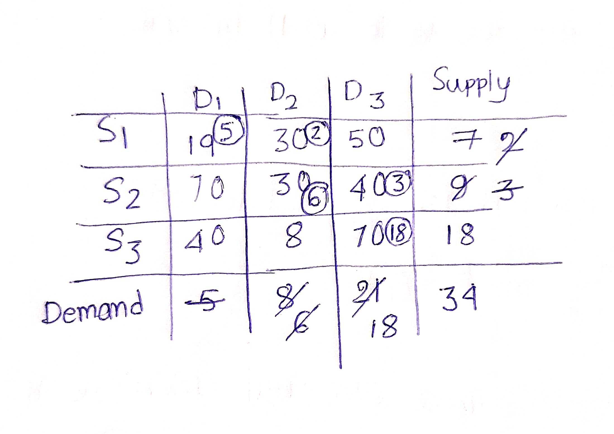

 
The **MODI (Modified Distribution Method)** or **UV Method** is an efficient way to optimize a basic feasible solution of a transportation problem. Heres steps of this method using an example with calculations.

## Problem Statement

Let's consider the following transportation problem. We have three sources $ S_1, S_2, S_3 $ and three destinations $ D_1, D_2, D_3 $. The supply available at each source and the demand at each destination are as follows:

$$
\begin{array}{|c|c|c|c|c|}
\hline
 & D_1 & D_2 & D_3 & \text{Supply} \\
\hline
S_1 & 19 & 30 & 50 & 7 \\
S_2 & 70 & 30 & 40 & 9 \\
S_3 & 40 & 8  & 70 & 18 \\
\hline
\text{Demand} & 5 & 8 & 21 & \\
\hline
\end{array}
$$

To solve the transportation problem, we must ensure that the problem is balanced ie. the total supply equals the total demand. 

$$
\text{Total Supply} = 7 + 9 + 18 = 34
$$

$$
\text{Total Demand} = 5 + 8 + 21 = 34
$$

Since total supply equals total demand, we can proceed to find a feasible solution.

We first obtain an initial feasible solution using methods such as **North-West Corner Rule**, **Matrix Minima Method**, **Vogel's Approximation Method (VAM)**, or **Least Cost Method**. Here, we use the North-West Corner Rule:

## Initial Feasible Solution (North-West Corner Rule)

$$
\begin{array}{|c|c|c|c|}
\hline
 & D_1 & D_2 & D_3 \\
\hline
S_1 & 5 & 2 & 0 \\
S_2 & 0 & 6 & 3 \\
S_3 & 0 & 0 & 18 \\
\hline
\end{array}
$$

Here no of allocation = m+n-1 = 5
And allocation are independent . so the problem is non-degenerate.
This satisfies all supply and demand constraints.

Initial Transportation cost 

$$  Total Cost=19*5 + 30*2 + 30*6 + 40*3 + 70*18  $$

$$  Total Cost=95+60+180+120+1260=1715 $$

Now we will use MODI method 
 