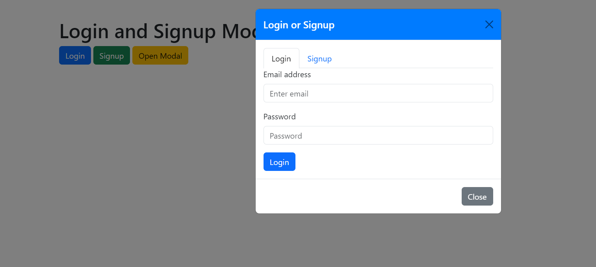

Bootstrap modals are a great way to manage forms, login, and signup options within a compact space on the webpage. Sometimes you may add  multiple tab inside a modal, for example login and signup forms You may want specefic signup or login tab open first. 

Well to create a modal containing two tabs: one for "Login" and another for "Signup." Using buttons outside of the modal, we'll control which tab should be active when the modal opens. This can be useful in scenarios where different actions trigger different tabs in the same modal.


##  Code

Here’s how you can achieve this functionality using Bootstrap 5:


```html
<h1>Login and Signup Modal Example</h1>
<button type="button" class="btn btn-primary" data-bs-toggle="modal" data-bs-target="#myModal" data-whatever="login">
    Login
</button>
<button type="button" class="btn btn-success" data-bs-toggle="modal" data-bs-target="#myModal" data-whatever="signup">
    Signup
</button>
<button type="button" class="btn btn-warning" data-bs-toggle="modal" data-bs-target="#myModal" data-whatever="default">
    Open Modal
</button>

<!-- Modal Structure -->
<div class="modal fade" id="myModal" tabindex="-1" aria-labelledby="myModalLabel" aria-hidden="true">
    <div class="modal-dialog">
        <div class="modal-content">
            <div class="modal-header">
                <h5 class="modal-title" id="myModalLabel">Login or Signup</h5>
                <button type="button" class="btn-close" data-bs-dismiss="modal" aria-label="Close"></button>
            </div>
            <div class="modal-body">
                <ul class="nav nav-tabs" id="myTab" role="tablist">
                    <li class="nav-item">
                        <a class="nav-link active" id="login-tab" data-bs-toggle="tab" href="#login" role="tab" aria-controls="login" aria-selected="true">Login</a>
                    </li>
                    <li class="nav-item">
                        <a class="nav-link" id="signup-tab" data-bs-toggle="tab" href="#signup" role="tab" aria-controls="signup" aria-selected="false">Signup</a>
                    </li>
                </ul>
                <div class="tab-content" id="myTabContent">
                    <div class="tab-pane fade show active" id="login" role="tabpanel" aria-labelledby="login-tab">
                        <form>
                            <div class="mb-3">
                                <label for="login-email" class="form-label">Email address</label>
                                <input type="email" class="form-control" id="login-email" placeholder="Enter email" required>
                            </div>
                            <div class="mb-3">
                                <label for="login-password" class="form-label">Password</label>
                                <input type="password" class="form-control" id="login-password" placeholder="Password" required>
                            </div>
                            <button type="submit" class="btn btn-primary">Login</button>
                        </form>
                    </div>
                    <div class="tab-pane fade" id="signup" role="tabpanel" aria-labelledby="signup-tab">
                        <form>
                            <div class="mb-3">
                                <label for="signup-email" class="form-label">Email address</label>
                                <input type="email" class="form-control" id="signup-email" placeholder="Enter email" required>
                            </div>
                            <div class="mb-3">
                                <label for="signup-password" class="form-label">Password</label>
                                <input type="password" class="form-control" id="signup-password" placeholder="Password" required>
                            </div>
                            <div class="mb-3">
                                <label for="signup-confirm-password" class="form-label">Confirm Password</label>
                                <input type="password" class="form-control" id="signup-confirm-password" placeholder="Confirm Password" required>
                            </div>
                            <button type="submit" class="btn btn-success">Signup</button>
                        </form>
                    </div>
                </div>
            </div>
            <div class="modal-footer">
                <button type="button" class="btn btn-secondary" data-bs-dismiss="modal">Close</button>
            </div>
        </div>
    </div>
</div>
```


Heres javaScript code you provided to switch tabs inside a Bootstrap modal based on the button clicked

```javascript
// JavaScript to switch tabs based on the button clicked
document.getElementById('myModal').addEventListener('show.bs.modal', function (event) {
    var button = event.relatedTarget; // Button that triggered the modal
    var tabToShow = button.getAttribute('data-whatever'); // Extract info from data-* attributes

    // Switch to the appropriate tab
    if (tabToShow === 'login') {
        var loginTab = new bootstrap.Tab(document.getElementById('login-tab'));
        loginTab.show();
    } else if (tabToShow === 'signup') {
        var signupTab = new bootstrap.Tab(document.getElementById('signup-tab'));
        signupTab.show();
    } else {
        var defaultTab = new bootstrap.Tab(document.getElementById('login-tab'));
        defaultTab.show(); // Default to login if 'default' button is clicked
    }
});
```




## Try It


<iframe height="500" style="width: 100%;" scrolling="no" title="Triggering Specific Tabs Inside a Bootstrap Modal Example" src="https://codepen.io/mrinalcs/embed/ZEgLNgW?default-tab=result&editable=true" frameborder="no" loading="lazy" allowtransparency="true" allowfullscreen="true">
  See the Pen <a href="https://codepen.io/mrinalcs/pen/ZEgLNgW">
  Untitled</a> by Mrinal (<a href="https://codepen.io/mrinalcs">@mrinalcs</a>)
  on <a href="https://codepen.io">CodePen</a>.
</iframe>


> :) A similar question posted <time datetime="2015-01">2015</time> <https://stackoverflow.com/questions/33084450>  but still relevant for some time.

## Reference

- <https://getbootstrap.com/docs/5.0/components/navs-tabs/>
- <https://getbootstrap.com/docs/5.0/components/modal/>