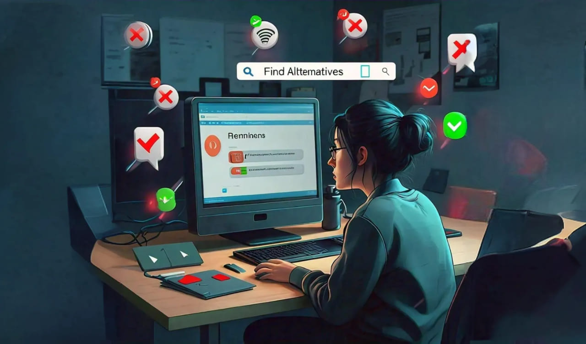

If you’ve been relying on a Chrome extension for your work and found that it has been removed from the Chrome Web Store, it can be frustrating to lose access to a favorite Chrome extension, which may be taken down by the author or the Chrome Store for violating policies.
 
## Why Extension Removed?

Before reinstalling a removed extension, check the reasons for its removal. If the extension was deemed malicious, it's better to avoid using it altogether. However, if you find it poses no risk or have verified that it is safe, you may proceed to use it. In cases where the extension was removed due to lack of maintenance rather than security issues, it can still be a viable option for your needs.

Keep in mind that even if you reinstall it, the extension may not work if it relies on a backend service that is no longer available.

## Ways to Get Removed Extensions 
There are several ways to use extensions removed from the Chrome Store. First, check if you have a backup of the extension's CRX file for manual installation in Chrome. If not, search alternative sources like GitHub or third-party websites that archive extensions. You can also look for similar extensions with comparable features.
 
### Backup from Your Local Machine 

If you previously installed the extension, it might still exist on your machine. Chrome stores extensions in a folder that you can access:
  
Navigate to `C:\Users\<YourUserName>\AppData\Local\Google\Chrome\User Data\Default\Extensions` 

Or use [CRX Extractor/Downloader Extention](https://chromewebstore.google.com/detail/crx-extractordownloader/ajkhmmldknmfjnmeedkbkkojgobmljda) or [CRX Extractor](https://crxextractor.com/) which allow you download chrome extentions directly as crx or zip file depending upon your choice.

### Alternative Sources
 
- **GitHub or Other Repositories**: Developers might host their projects on GitHub. Search for the extension’s name along with “GitHub” to find the repository.
- **Third-party Extension Sites**: There are lots of sites which redirect you back to the Chrome Store or offer fake download links. However, I found a reliable option is [Chrome Stats](https://chrome-stats.com/), which provides a legitimate way to find and download extensions, it have Edge and Firefox extentions also.
 
**Caution**: Be extremely careful when downloading from third-party sites. They may not be safe, and the extensions could be modified to include malware. 

### Use a Previous Version

If you have access to the extension files, you can revert to an earlier version of the extension:

- **Find Previous Versions**: Look for older releases in GitHub repositories or extension repositories. These may still be available even if the latest version was removed.
- **Follow the Manual Installation Steps** to load the previous version.

## Install the Extension

To install the extension:

1. **Open Chrome Extensions**: Go to `chrome://extensions/`.
2. **Enable Developer Mode**: Toggle on **Developer mode** in the top right corner.
3. **Load the Extension**:
   - **CRX File**: Drag and drop the CRX file onto the Extensions page.
   - **ZIP File**: Extract the ZIP file, then click **Load unpacked** and select the extracted folder.

## Use an Alternative Extension

If the extension you need is no longer available, better to consider finding a similar alternative:

**Search in the Chrome Web Store**: Use keywords related to the functionality of the removed extension.
**Explore User Reviews and Ratings**: Look for extensions that offer similar features and have positive feedback from users.

## Conclusion

In summary, while it can be useful to access removed extensions, it’s essential to proceed with caution. Always ensure you are sourcing files from reputable locations and remain vigilant about the potential risks involved.
Feel free to modify any part of it according to your preferences!

**Note**: This method only works if you have the extension files available and may not function if the extension relies on online services or updates.
