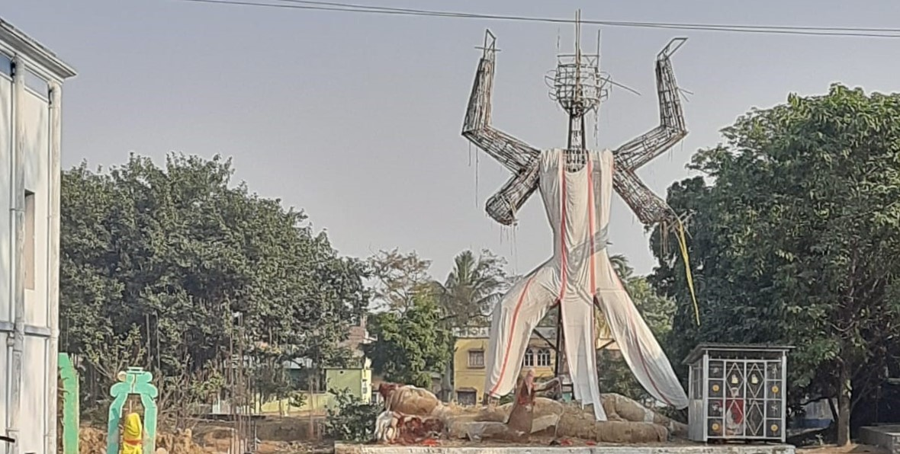
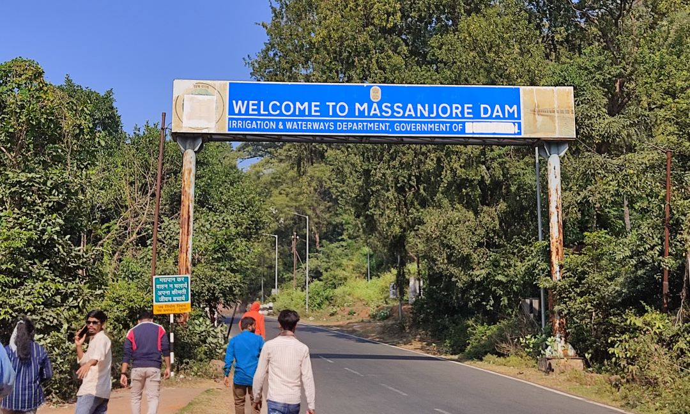
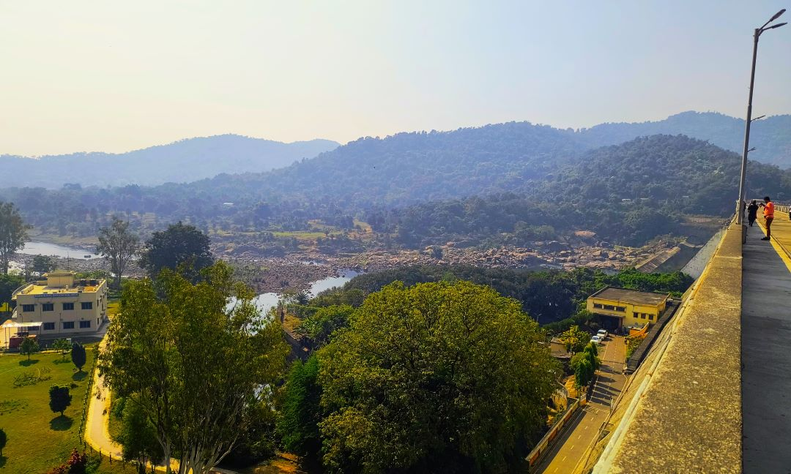
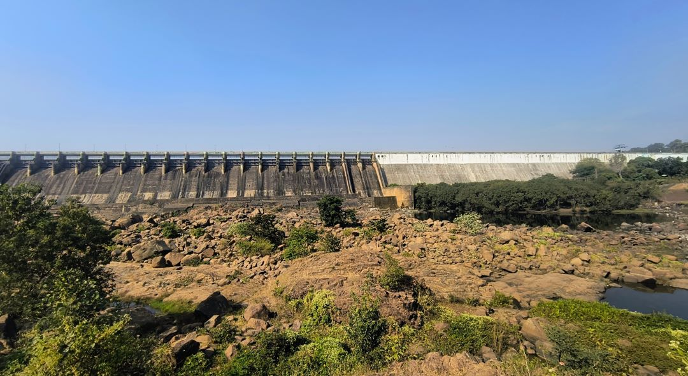
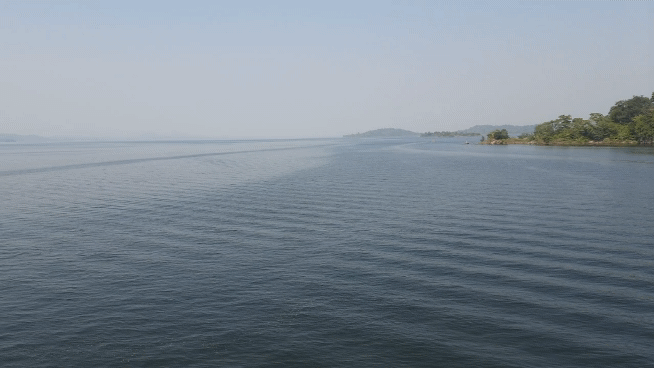
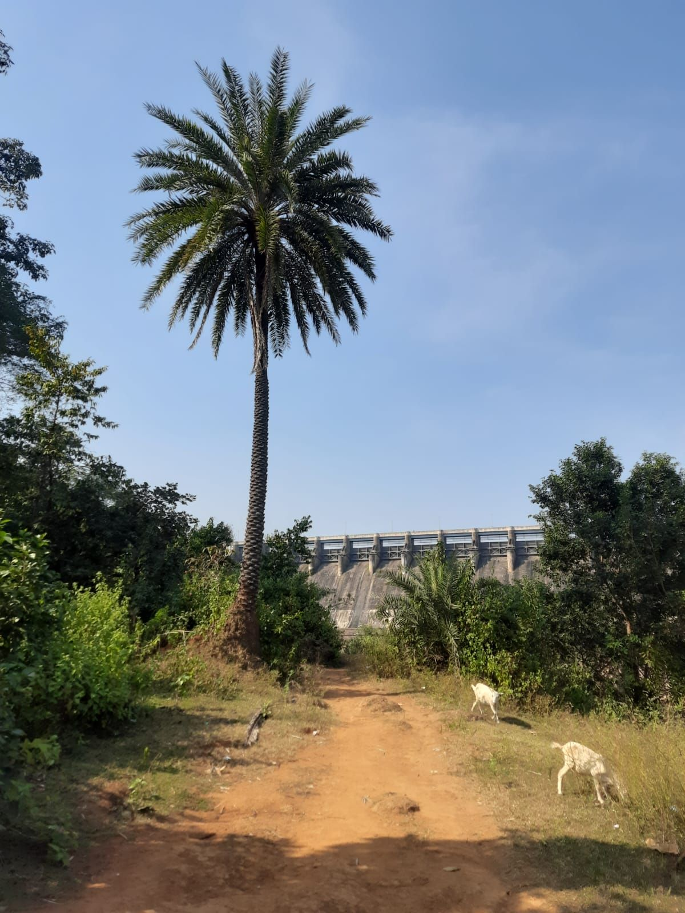
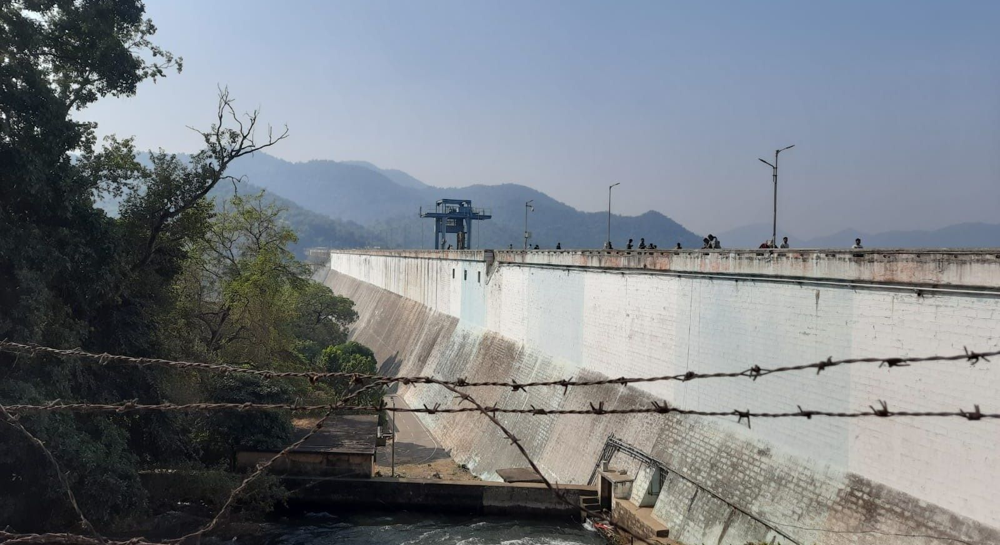

On the <time datetime="2024-12-07">7th of December</time>,  Saturday.
 
We, me and hostelers from our department took a bus from **Sriniketan** around **7:30 AM**. The early morning taking bath in cold water having tea was refreshing. The journey was different with music in the bus and friends.

While this time I captured this on the way. By **10:00 AM**, we had reached our destination.

 
After arriving at the dam, we played batminton cricket, breakfast with gughni muri chap and jilapi. It was simple, but perfect for the morning, especially with the lovely view around us.  
After breakfast, we decided to climb a nearby hill to get a better view of the dam. From the top, the view was breathtaking—vast waters with rolling hills in the distance.

Some of us decided to go boating, though I opted not to. The water was chilly, and after watching a few brave souls swim, we all agreed it was better to enjoy the view from the shore.

The most memorable part of the trip was climbing the hills and taking photos 😄 . We ventured to a rock formation in the middle of the river where the water was low, surrounded by large rocks. It made for the perfect photoshoot spot. Everyone got a chance to strike a pose and capture some great memories!