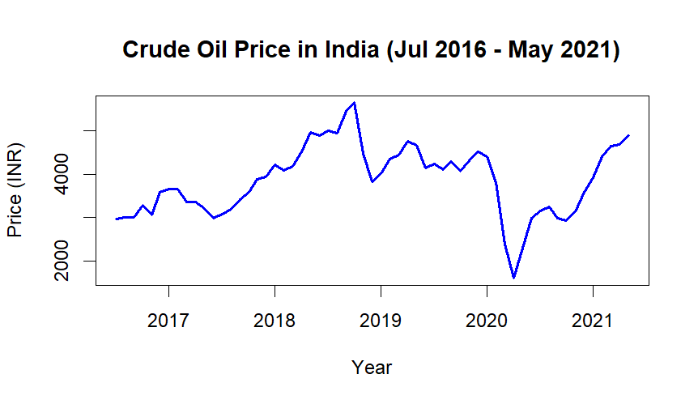
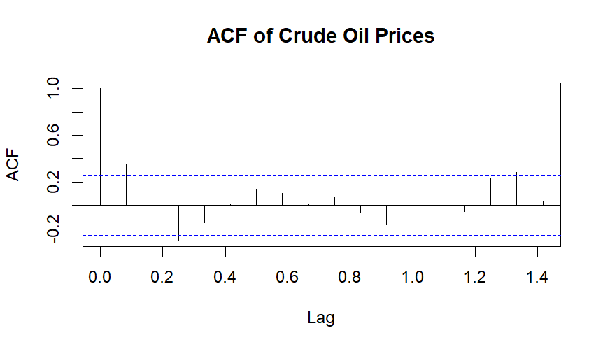
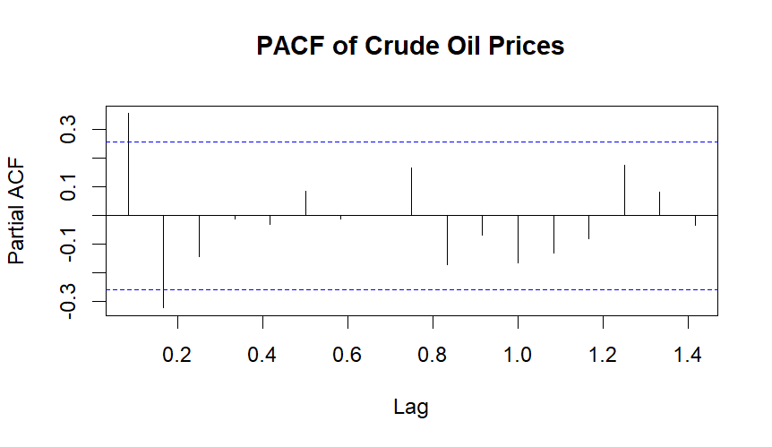
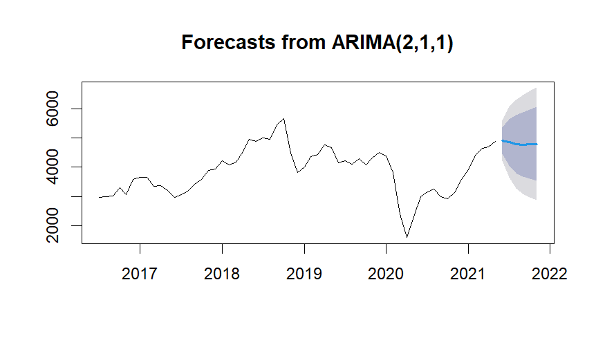
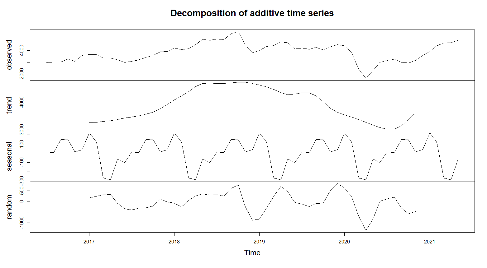
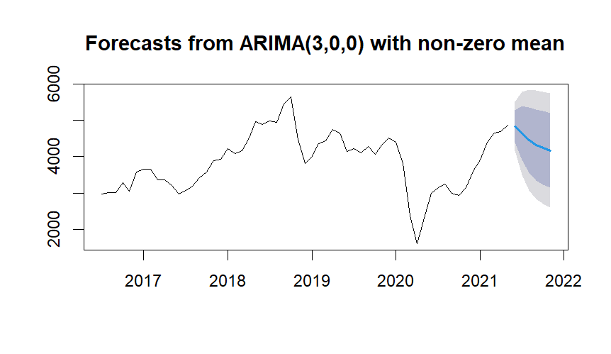

Crude oil is a core commodity that significantly impacts both the global and Indian economies. India is the **3rd largest oil importer**, relying on imports for about 70% of its crude oil needs. Oil accounts for approximately 30% of India's total energy consumption. This analysis explores the price trends of crude oil in India using time series techniques.

## Objectives 
- To analyze the trends in crude oil prices.
- To forecast crude oil prices. 

## Data Source
*   The data used in this study consists of monthly crude oil prices.
*   The data was collected from the websites of commodity exchanges (MCX India) from July 2016 to May 2021. Open the data [crude_oil_prices.csv](crude_oil_prices.csv).
  
## Descriptive Statistics 
- **Minimum price:** 1,603 INR
- **Maximum price:** 5,649 INR
- **Median price:** 3,919 INR
- **Mean price:** 3,852 INR 



## ADF Test

```output
> adf_test <- tseries::adf.test(ts_data, alternative = "stationary")
> print(adf_test)
	Augmented Dickey-Fuller Test
data:  ts_data
Dickey-Fuller = -1.7516, Lag order = 3, p-value = 0.6751
alternative hypothesis: stationary
```

The initial ADF test yielded a **p-value of 0.6751**, which is higher than the significance level (0.05), indicating the series is **non-stationary**. 


```output
> ts_data_diff1 <- diff(ts_data)
> # Apply ADF test again on differenced series
> adf_test_diff1 <- adf.test(ts_data_diff1)
> print(adf_test_diff1)
	Augmented Dickey-Fuller Test
data:  ts_data_diff1
Dickey-Fuller = -4.0041, Lag order = 3, p-value = 0.01568
alternative hypothesis: stationary
```

Differencing was applied to the data, resulting in a **stationary series** with a **p-value of 0.01568**, which is less than 0.05 .

## ACF & PACF
Based on ACF and PACF depends the order of ARIMA model.





Based on above ACF and PACF choose ARIMA(2,1,1) is a time series model with 2 autoregressive terms, first-order differencing, and 1 moving average term. 

## Forecast using ARIMA




But here Wider error bands suggest higher uncertainty in the forecast.



There is seasonal patternt in the data, including seasonal components Auto ARIMA in R



```output
> print(forecast_values)
         Point Forecast    Lo 80    Hi 80    Lo 95    Hi 95
Jun 2021       4835.478 4395.331 5275.624 4162.332 5508.623
Jul 2021       4646.724 3901.259 5392.188 3506.635 5786.813
Aug 2021       4459.424 3554.567 5364.281 3075.565 5843.283
Sep 2021       4327.160 3350.202 5304.119 2833.031 5821.289
Oct 2021       4239.321 3226.697 5251.944 2690.647 5787.995
Nov 2021       4173.800 3139.547 5208.053 2592.047 5755.553
```

## Conclusion
Forecast results from the model predicted a decline in crude oil prices in the upcoming 6 months of 2021.

Limitations of the study include that the model does not integrate external factors, such as global events and OPEC output, which can significantly influence crude oil prices. The study suggests that future research should focus on incorporating external variables and extending the historical dataset to improve accuracy.

## References
- [https://www.investopedia.com/terms/c/crude-oil.asp](https://www.investopedia.com/terms/c/crude-oil.asp)
- [https://www.mcxindia.com/products/energy/crude-oil](https://www.mcxindia.com/products/energy/crude-oil)
- [https://www.statisticshowto.com/unit-root/](https://www.statisticshowto.com/unit-root/)
- [https://www.investopedia.com/articles/investing/072515/top-factors-reports-affect-price-oil.asp](https://www.investopedia.com/articles/investing/072515/top-factors-reports-affect-price-oil.asp)
