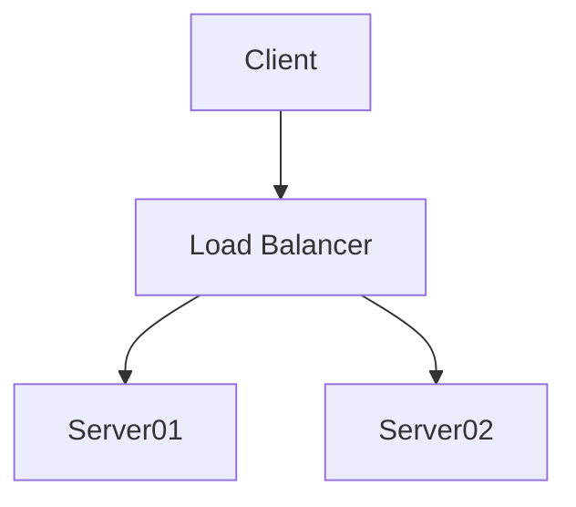

There are many plugins available that you can use, but it’s simpler to manipulate and render diagrams using JavaScript rather than relying on Plugins. This approach allows for more flexibility how diagrams are generated and displayed

## Add Mermaid Js
To enable Mermaid diagrams, first add the following Mermaid script to your Jekyll site:

```html
<script type="module">
    import mermaid from 'https://cdn.jsdelivr.net/npm/mermaid@10/dist/mermaid.esm.min.mjs';
    mermaid.initialize({ startOnLoad: true });
</script>
```

## Create a Mermaid Diagram

Now, you can create a Mermaid diagram in your Markdown file. Here is an example of a simple flowchart:

```html
<pre class="mermaid">
        graph TD
        A[Client] --> B[Load Balancer]
        B --> C[Server01]
        B --> D[Server02]
</pre>
```


 

## Render Diagrams from Markdown Code Blocks
It easier if Mermaid diagrams in Markdown code blocks  automatically rendered.

```html
<script type="module">
  import mermaid from 'https://cdn.jsdelivr.net/npm/mermaid@11/dist/mermaid.esm.min.mjs';
  mermaid.initialize({ startOnLoad: true });

  document.querySelectorAll('pre > code.language-mermaid').forEach((codeBlock) => {
    codeBlock.parentElement.outerHTML = `<pre class="mermaid">${codeBlock.textContent}</pre>`;
  });
</script>
```
This script finds all code blocks with the language-mermaid class and converts them into pre blocks with the mermaid class, allowing Mermaid to render them dynamically.

<p class="codepen" data-height="500" data-slug-hash="jENLVYR" data-pen-title="Untitled" data-user="mrinalcs" style="height: 500px; box-sizing: border-box; display: flex; align-items: center; justify-content: center; border: 2px solid; margin: 1em 0; padding: 1em;">
  <span>See the Pen <a href="https://codepen.io/mrinalcs/pen/jENLVYR">
  Untitled</a> by Mrinal (<a href="https://codepen.io/mrinalcs">@mrinalcs</a>)
  on <a href="https://codepen.io">CodePen</a>.</span>
</p>
<script async src="https://public.codepenassets.com/embed/index.js"></script>
