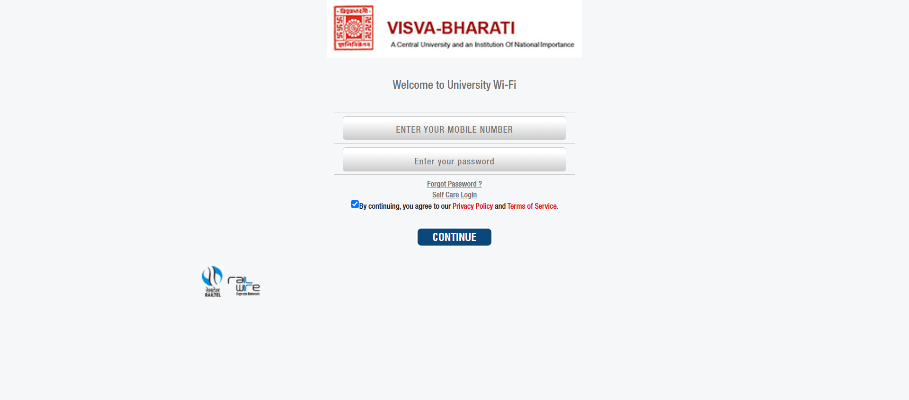
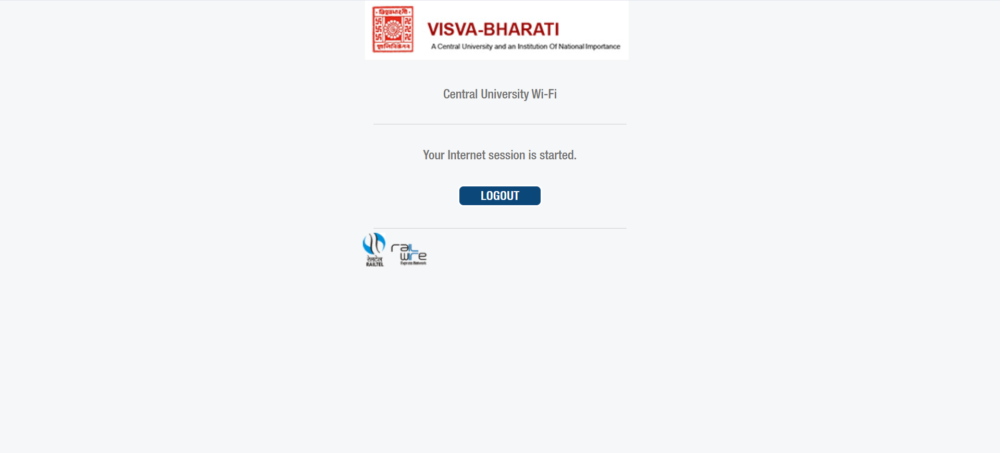
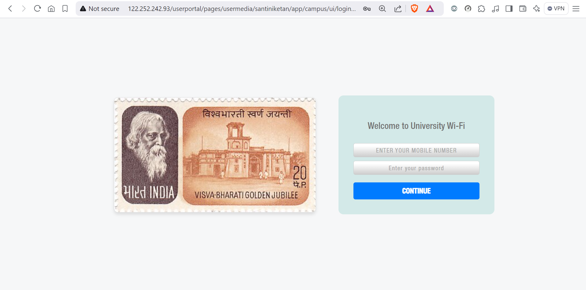
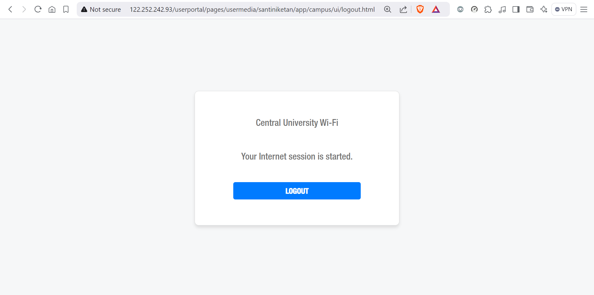

 
If you familiar with the Moe Wifi network this may relevent, its login page can be a bit bland. But heres how to customize the style of the login page to give it a more personalized touch. This is just an example, and you can add your own custom styles to change the look and feel of the login page.

 
 
  

## Inject the CSS
To inject the custom CSS file into the login page, we'll use a chrome browser extension like [Stylish or Stylebot](/change-website-style-in-browser).

```css
/* Reset Styles */
body {
    margin: auto; 
    background-color: transparent;
    color: #333;
    display: flex;
    justify-content: center;
    align-items: center;
    height: 100vh;
    transition: background-color 0.3s ease-in-out;
}

/* Layout */
.container {
    width: 100%;
    max-width: 360px;
    padding: 20px;
    background-color: #ffffff;
    border: 1px solid #ddd;
    border-radius: 8px;
    box-shadow: 0 4px 6px rgba(0, 0, 0, 0.1);
    transition: box-shadow 0.3s ease-in-out, transform 0.3s ease-in-out;
}

body > .container {
    display: block !important;
    background-image: url(https://upload.wikimedia.org/wikipedia/commons/thumb/0/07/Visva-Bharati_University_1971_stamp_of_India.jpg/360px-Visva-Bharati_University_1971_stamp_of_India.jpg);
    min-height: 50vh;
    background-size: cover;
}

/* Form Elements */
.voucher-pin {
    display: flex;
    flex-direction: column;
    gap: 10px;
}

.voucher-pin input {
    width: 100%;
    padding: 10px;
    border: 1px solid #ccc;
    border-radius: 4px;
    font-size: 14px;
    background-color: #fdfdfd;
    box-sizing: border-box;
    transition: border-color 0.2s ease-in-out, box-shadow 0.2s ease-in-out;
}

.voucher-pin input::placeholder {
    color: #aaa;
    font-size: 12px;
}

/* Button Styles */
.voucher-pin input[type="submit"] {
    background: #007bff;
    color: #ffffff;
    border: none;
    font-weight: bold;
    cursor: pointer;
    border-radius: 4px;
    transition: background-color 0.2s ease-in-out, transform 0.2s ease-in-out;
}

.voucher-pin input[type="submit"]:hover {
    background: #0056b3;
    transform: translateY(-1px);
}

/* State Styles */
.voucher-pin input:focus {
    outline: none;
    border-color: #007bff;
    box-shadow: 0 0 6px rgba(0, 123, 255, 0.5);
    background-color: #ffffff;
}

/* Hidden Elements */
.header, .footer, .pptc, a.forgot {
    display: none;
}

hr {
    display: none;
}
/* Miscellaneous */
.main-links .first-page, .mobile-no .voucher-pin, .main-links, .choose-ur-plan, .voucher-pin {
    background-color: transparent;
}

form {
    background: #80cbc445 !important;
    min-width: 250px;
}

form#form1 {
    padding: 30px;
    border-radius: 10px;
    box-shadow: 0 4px 6px rgba(0, 0, 0, 0.1) !important;
}
```



*[Image from Wikimedia](https://upload.wikimedia.org/wikipedia/commons/0/07/Visva-Bharati_University_1971_stamp_of_India.jpg)*


## Conclusion
Customizing the style of the Moe Wifi login page is a fun and easy way to personalize and give the login page a fresh new look that you like. So get creative and show off your to your friends! 😁