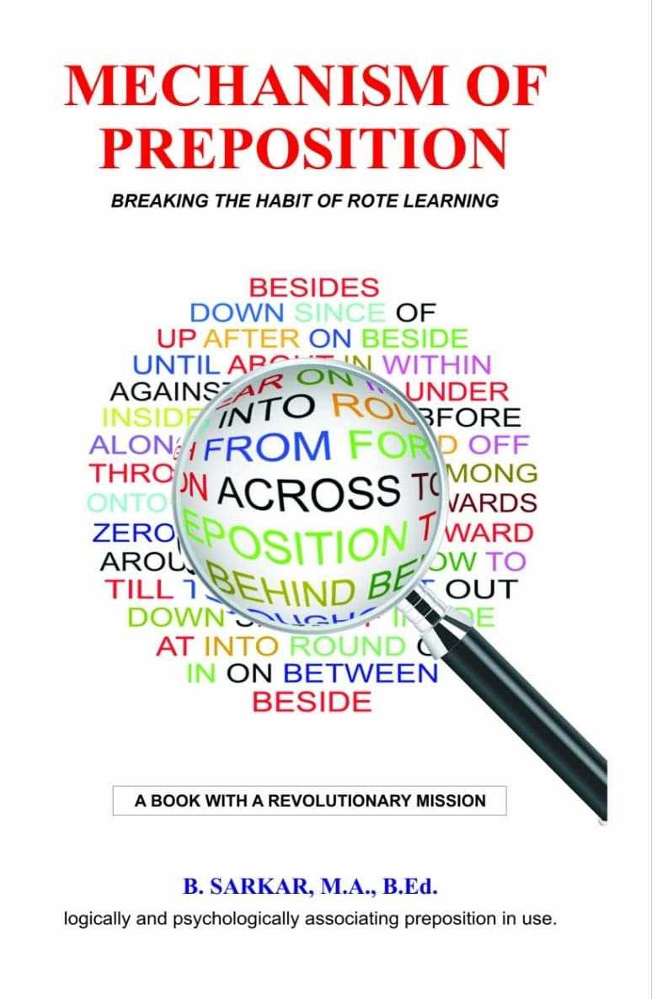
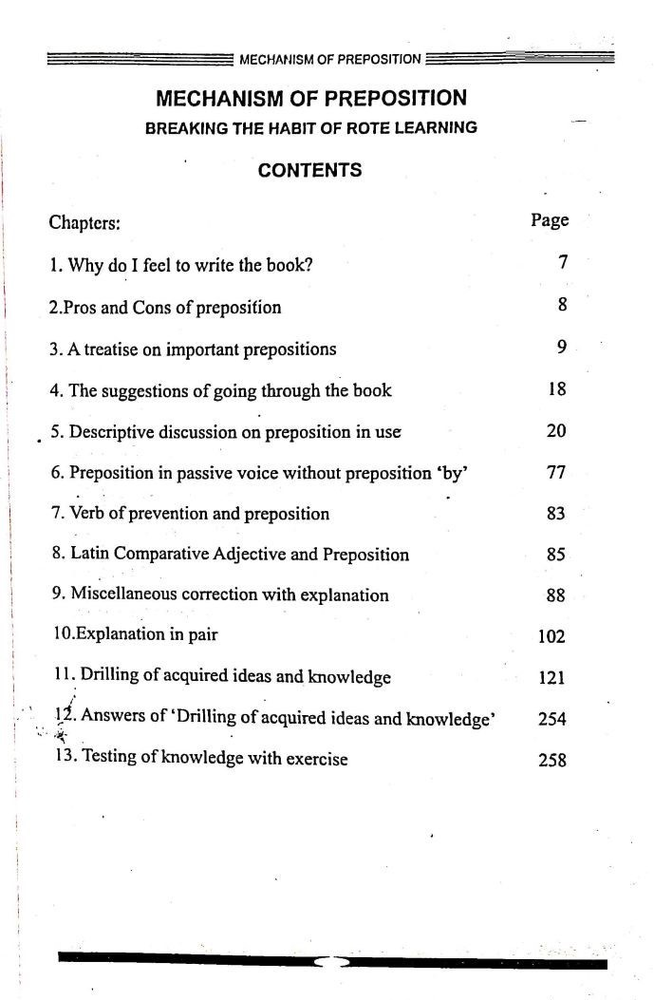

In English grammar, prepositions seems as one of the most perplexing areas for learners and even educators. When we encountered the traditional method of learning simply memorizing which preposition fits where, it felt like scraping the surface of a vast ocean of language. That’s where **Mechanism Of Preposition** by my teacher, Bapi Sarkar take us beyond memorization and into the realm of logic and understanding. Images and stories helps to imagine and hard to forget. 

<figure>
  
  <figcaption>Book Cover: Mechanism of Preposition</figcaption>
</figure>

<figure>
  
  <figcaption>Contents: Mechanism of Preposition</figcaption>
</figure>

  
Chapter List

  <ol>
    <li>Why do I feel to write the book?</li>
    <li>Pros and Cons of preposition</li>
    <li>A treatise on important prepositions</li>
    <li>The suggestions of going through the book</li>
    <li>Descriptive discussion on preposition in use</li>
    <li>Preposition in passive voice without preposition 'by'</li>
    <li>Verb of prevention and preposition</li>
    <li>Latin Comparative Adjective and Preposition</li>
    <li>Miscellaneous correction with explanation</li>
    <li>Explanation in pair</li>
    <li>Drilling of acquired ideas and knowledge</li>
    <li>Answers of 'Drilling of acquired ideas and knowledge'</li>
    <li>Testing of knowledge with exercise</li>
  </ol>

## A Fresh Perspective on Prepositions

Unlike conventional grammar guides that rely heavily on repetitive examples, this book dives deep into the underlying logic behind the use of prepositions. Instead of asking, “Which preposition fits here?” the book encourages us to think: “Why does this preposition work here?” This shift from memorization to comprehension not only demystifies the use of words like *on*, *in*, *by*, and *with* but also illuminates the subtle nuances that often get lost in translation.

For example:  **There is a village on/by the river.**

Both prepositions are correct, yet each evokes a distinct image. When **on** is used, the focus shifts to the surrounding plain—downplaying the river's presence. In contrast, **by** emphasizes the river itself, suggesting proximity and prominence. [A snippet, page 68](252103.jpg).

## Breaking the Chains of Rote Learning

What makes *Mechanism Of Preposition* stand out is its clear message: the English we use isn’t arbitrary or random; it’s a heritage built on centuries of logic and reasoning by modern scholars. The book delves into why we say “I know him” rather than “I know him by” or “He is moved at the sight” instead of “by the sight.” Each explanation is backed by logic, urging readers to move away from mechanical learning and to embrace a deeper understanding of language.
 
## Personal Reflections

I still remember being in class 12 when Sir, was writting this book. The way he explained prepositions detailing why a particular preposition is used in a specific context and how even a slight change can completely alter the meaning of a sentence was absolutely captivating. Although I could not engage with the book back then, I have recently read it.  

## Who Should Read This Book?

Whether you are an English medium student, a teacher, or simply someone passionate about language, this book is a must-read. It’s particularly beneficial for:

- *Students* who are tired of memorizing endless lists of rules.
- *Educators* seeking innovative ways to teach grammar.
- *Writers and language enthusiasts* who want to understand the deeper mechanics of English.

## Final Thoughts

**Mechanism Of Preposition** is more than just a grammar guide; it’s an invitation to reimagine how we learn and use language.This promotes clarity, critical thinking, and a deeper appreciation for English.

If you’ve ever felt bogged down by the rigid rules of prepositions or simply yearn for a more meaningful grasp of English, I highly recommend giving this book a try. You can find the book on [Amazon](https://amzn.in/d/gYISc4C)

 
