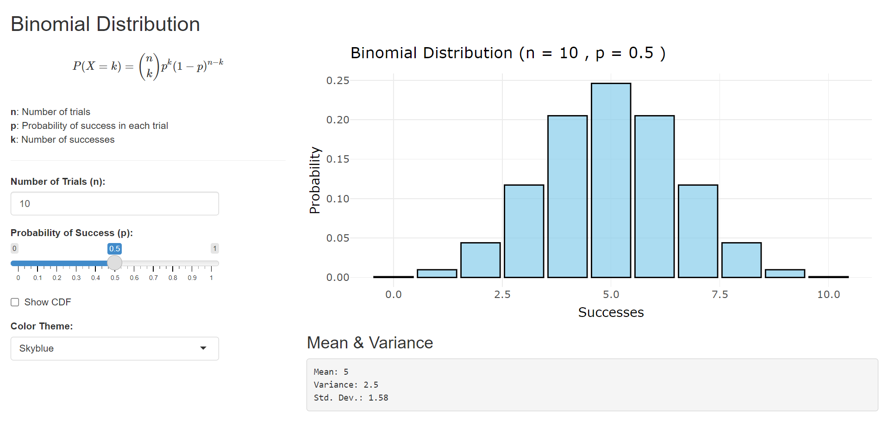

 
The Binomial distribution is a probability distribution that describes the probability of obtaining exactly *k* successes in *n* independent Bernoulli trials (where each trial has only two possible outcomes, usually called "success" and "failure").  It's defined by the following formula:

$$
P(X = k) = \binom{n}{k} p^k (1 - p)^{n-k}
$$
 
Where: 
- $n$: Number of trials  
- $p$: Probability of success in each trial  
- $k$: Number of successes  
 
<!-- 
<iframe src="https://mrinalcs.shinyapps.io/binomial-distribution-visualization/" width="100%" height="600px" style="border: 1px solid #ccc;"></iframe> -->

👉 [Binomial Distribution Visualization](https://mrinalcs.shinyapps.io/binomial-distribution-visualization/)

**Key Features and How to Use:**

The Shiny app provides an intuitive interface for experimenting with the Binomial distribution.  You can:

*  Adjust *n* (Number of Trials): See how increasing the number of trials affects the spread and shape of the distribution.  Larger values of *n* generally lead to a wider distribution.
*  Adjust *p* (Probability of Success): Observe how changing the probability of success influences the distribution's skewness.  Values of *p* closer to 0 or 1 result in skewed distributions, while values closer to 0.5 tend to produce more symmetrical distributions.
*  Visualize the Probabilities:The chart dynamically updates to display the probability of each possible outcome (number of successes) for the chosen parameters.  The height of each bar represents the probability *P(X = k)*.
*  Explore Mean and Variance:This also displays the calculated mean and variance of the distribution, providing further insights into its properties.
 