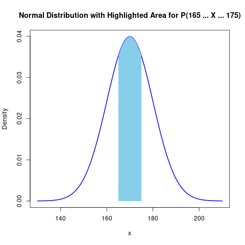
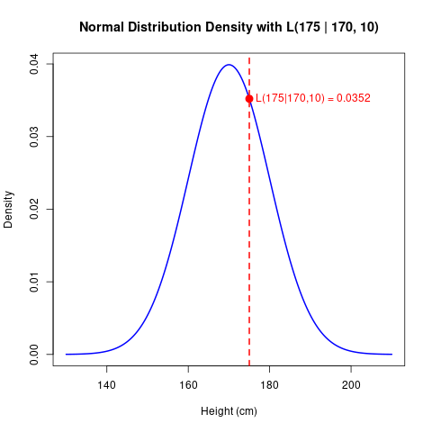

 
In Statistics the terms probability and likelihood often appear side by side and creat confusion sometime. Although they might sound similar, they serve distinct roles in the way we interpret data and draw inferences.  

---

## What Is Probability?

**Probability** is a measure of the chance that a particular event will occur. It’s a forward concept: given a model or a set of parameters, probability tells you how likely it is to see a particular outcome.

For example, when tossing a fair coin, the probability of getting heads is:

$$
P(\text{Heads}) = 0.5.
$$

This probability is calculated **before** the experiment, using the known properties of the coin.
 

---

## What Is Likelihood?

**Likelihood** is a different idea. Instead of asking, "Given these parameters, what is the chance of this data?" it asks, "Given this observed data, how plausible are different parameter values?" This is very important in techniques like **Maximum Likelihood Estimation (MLE)**.

Imagine a series of coin tosses. Instead of asking for the probability of the outcomes (assuming a specific bias), you ask: *"What values of the coin's bias (the probability of heads) make this sequence most likely?"*

Mathematically, the observed data $x$ and a model parameter $\theta$, the **likelihood function** is defined as:

$$
\mathcal{L}(\theta \mid x) = P(x \mid \theta).
$$

Notice that even though this looks like probability, here $x$ (data) is fixed, and $\theta$ (the parameter) is what changed.
 
---

## Coin Toss Example

Lets take a common example suppose you tossed a coin 10 times and got heads 7 times. You might ask: *Is this coin fair?*

**Probability Perspective:** 
If you assume the coin is fair ($\theta = 0.5$), the probability of getting 7 heads is calculated by the binomial distribution:

  $$
  P(7 \text{ heads} \mid \theta = 0.5) = \binom{10}{7} (0.5)^7 (0.5)^3.
  $$

**Likelihood Perspective:**  
If you are not sure about the coin’s fairness, you calculate the likelihood for different values of $\theta$  (the chance of heads):

$$
\mathcal{L}(\theta \mid \text{7 heads, 3 tails}) = \binom{10}{7} \theta^7 (1-\theta)^3.
$$
 

If $\theta = 0.5$ : The likelihood of observing 7 heads in 10 tosses is about **0.117**.  
If $\theta = 0.7$ : The likelihood increases to about **0.267**.

This indicate that the observed data (7 heads out of 10 tosses) is more “likely” if the coin's bias is 0.7 rather than 0.5.

## Height of Students Example

Suppose we know that the heights of students in a class are approximately normally distributed. We can use this example to illustrate the difference between probability and likelihood.

**Probability Perspective:** 

Assume the students' heights follow a normal distribution with a known mean $ \mu = 170 $ cm and standard deviation $ \sigma = 10 $ cm. The probability of a randomly selected student having a height between 165 cm and 175 cm is given by:

$$
P(165 \leq X \leq 175) = \int_{165}^{175} \frac{1}{\sqrt{2\pi} \cdot 10} \exp\left(-\frac{(x-170)^2}{2 \cdot 10^2}\right) dx.
$$

This probability is calculated using the known parameters and tells us the chance that any individual student's height falls within this range.

**Likelihood Perspective:**

Now, imagine you have collected the heights of 30 students, but you don't know the true parameters $ \mu $ and $ \sigma $. Instead, you want to infer them from the data. The likelihood function for the observed heights $ x_1, x_2, \dots, x_{30} $ is:

$$
\mathcal{L}(\mu, \sigma \mid x_1, x_2, \dots, x_{30}) = \prod_{i=1}^{30} \frac{1}{\sqrt{2\pi} \, \sigma} \exp\left(-\frac{(x_i - \mu)^2}{2\sigma^2}\right).
$$

 

Now want to find likelihood of observing a student with a height of 175 cm is given by the normal density function evaluated at \( x = 175 \):

$$
\mathcal{L}(175 \mid \mu, \sigma) = \frac{1}{\sqrt{2\pi} \, \sigma} \exp\left( -\frac{(175 - \mu)^2}{2\sigma^2} \right).
$$
 
$$
\begin{aligned}
\mathcal{L}(175 \mid 170, 10) &= \frac{1}{\sqrt{2\pi} \cdot 10} \exp\left( -\frac{(175 - 170)^2}{2 \cdot 10^2} \right) \\
&= \frac{1}{\sqrt{2\pi} \cdot 10} \exp\left( -\frac{25}{200} \right) \\
&= \frac{1}{\sqrt{2\pi} \cdot 10} \exp(-0.125) \\
&\approx 0.0399 \times 0.8825 \\
&\approx 0.0352
\end{aligned} 
$$

Thus, the likelihood of a student having a height of 175 cm is approximately **0.0352**.

---
 
## Conclusion

Both probability and likelihood are very important in statistics, but they answer different questions. **Probability** tells us how likely an outcome is given some assumptions, while **likelihood** tells us how possible different assumptions are given the observed outcomes.
