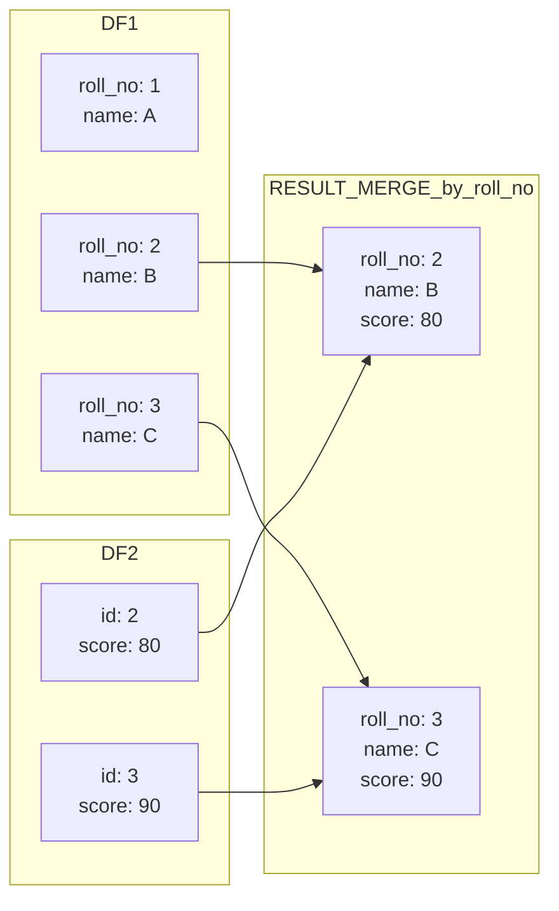

> In data science, clean data is half the battle won.

  
**Data Wrangling** is the process of cleaning, organizing, transforming, and preparing raw data into a structured and usable format for analysis. It involves handling missing values, correcting inconsistencies, filtering irrelevant information, and reshaping datasets to ensure accuracy and consistency.
 
## Importing Data in R
Import data from various sources including Text, CSV, Excel, Database, Google Sheets, and Financial APIs

### Text File
```r
# Importing a text file
data_txt <- read.table("data.txt", header = TRUE)

# Importing a tab-delimited file
data_tab <- read.delim("data.txt", header = TRUE)
```

### CSV File

```r
library(readr)
dataset <- read_csv(data.csv)
```

### Excel File

```r
library(readxl)
dataset <- read_excel(data.xlsx) 
```

### Database

```r
library(DBI)
con <- dbConnect(RMySQL::MySQL(),
                 dbname = "dbname",
                 host = "localhost",
                 user = "username",
                 password = "password")

# Read a table 
data <- dbReadTable(con, "table_name")
```

### Google Sheets

```r
library(googlesheets4)
data <- read_sheet("https://docs.google.com/spreadsheets/d/your_sheet_id")
```

###  Financial APIs

```r
library(quantmod) 
getSymbols("AAPL", src = "yahoo")     # Apple stock 
```

## Exploring the Dataset

```r
View(df) # View complete data frame
```


### Structure

```r
head(df)       # First 6 rows
tail(df)       # Last 6 rows
dim(df)        # Dimensions (rows, columns)
str(df)        # Structure of the dataset
summary(df)    # Summary statistics
colnames(df)   # Column names
```


### Data Types

```r
sapply(df, class) # Class of each column
typeof(df$column_name) # Internal type of a column

```
 

## Handling Missing Values

```r
is.na(df)  # Logical matrix showing NA values
sum(is.na(df))  # Total number of missing values
colSums(is.na(df))  # Number of missing values per column
rowSums(is.na(df))  # Number of missing values per row
anyNA(df)  # Returns TRUE if any NA exists
```

### Remove Missing Values

```r
df <- na.omit(df)         # Remove rows with missing values
```

### Replacing Missing Values


```r
# Replace with a specific value (e.g., 0)
df$column_name[is.na(df$column_name)] <- 0

# Replace with the mean (for numeric columns)
df$column_name[is.na(df$column_name)] <- mean(df$column_name, na.rm = TRUE)

# Replace with the median (for numeric columns)
df$column_name[is.na(df$column_name)] <- median(df$column_name, na.rm = TRUE)
```

## Handling Outliers
There are multiple ways to detect and remove outliers. The best method depends on the dataset and context. IQR and Z-score methods are widely used.

### Visualizing Outliers with Boxplots

```r
boxplot(df$column_name, main = "Boxplot of Column", col = "red")
```
### Using the IQR

```r
# Compute Q1 (25th percentile) and Q3 (75th percentile)
Q1 <- quantile(df$column_name, 0.25, na.rm = TRUE)
Q3 <- quantile(df$column_name, 0.75, na.rm = TRUE)

# Calculate IQR
IQR <- Q3 - Q1

# Define lower and upper bounds
lower_bound <- Q1 - 1.5 * IQR
upper_bound <- Q3 + 1.5 * IQR

# Filter out outliers
df_clean <- df[df$column_name >= lower_bound & df$column_name <= upper_bound, ]
```

### Using the Z-score

```r
# Compute Z-scores
df$z_score <- (df$column_name - mean(df$column_name, na.rm = TRUE)) / sd(df$column_name, na.rm = TRUE)

# Remove outliers
df_clean <- df[abs(df$z_score) <= 3, ]
```

### Using Boxplot Stats

```r
# Identify outliers using boxplot stats
outliers <- boxplot.stats(df$column_name)$out

# Remove outliers
df_clean <- df[!df$column_name %in% outliers, ]
```

## Renaming Columns

```r
# Rename all columns by vector of names
colnames(df) <- c("new_name1", "new_name2", "new_name3")
# Change only the second column's name
colnames(df)[2] <- "new_column_name"
```

## Filtering and Subsetting

### Subsetting Rows
```r
# Select rows where column value is greater than 50
df_subset <- df[df$column_name > 50, ]
# Select rows where column equals a specific value
df_subset <- df[df$gender == "Male", ]
# Multiple conditions using logical AND (&) and OR (|)
df_subset <- df[df$age > 25 & df$gender == "Female", ]
df_subset <- df[df$age > 25 | df$income > 50000, ]
# Exclude rows where age is less than 25
df_subset <- df[!(df$age < 25), ]
# Keep rows where column is not NA
df_subset <- df[!is.na(df$income), ]
```

### Subsetting Specific Columns
```r
# Select specific columns
df_subset <- df[, c("name", "age", "gender")]
# Select a column using the $ operator
gender_vector <- df$gender
```


## Creating New Variables (Mutating)

```r
# Create a new column: total price (unit price * quantity)
df$total_price <- df$unit_price * df$quantity

# Create a categorical column based on a condition
df$income_group <- ifelse(df$income > 50000, "High", "Low")
```

## Normalization and Standardization
### Normalization (Min-Max Scaling)

$$
X_{norm} = \frac{X - \min(X)}{\max(X) - \min(X)}
$$

```r
# Normalize a column using min-max scaling
df$normalized_col <- (df$column_name - min(df$column_name, na.rm = TRUE)) /
                     (max(df$column_name, na.rm = TRUE) - min(df$column_name, na.rm = TRUE))
```

### Standardization (Z-score Scaling)

$$
X_{std} = \frac{X - \mu}{\sigma}
$$

```r
# Standardize a column using z-score
df$standardized_col <- (df$column_name - mean(df$column_name, na.rm = TRUE)) /
                       sd(df$column_name, na.rm = TRUE)
```


## Grouping 
Grouping is used to compute summary statistics for each group in a dataset for example, mean income by gender, sales by region, or count by category.


```r
# Mean income by gender
aggregate(income ~ gender, data = df, FUN = mean)

# Multiple summary functions
aggregate(cbind(income, expenditure) ~ gender, data = df, FUN = mean)

# Sum of sales by region
aggregate(sales ~ region, data = df, FUN = sum)
```


## Merging and Joining Datasets

```r
# Inner Join (default)
merged_data <- merge(df1, df2, by = "id")

# Left Join
merged_data <- merge(df1, df2, by = "id", all.x = TRUE)

# Right Join
merged_data <- merge(df1, df2, by = "id", all.y = TRUE)

# Full Join
merged_data <- merge(df1, df2, by = "id", all = TRUE)

# Join by different column names
merged_data <- merge(df1, df2, by.x = "roll_no", by.y = "id")

```
 

Dataset `df1`

| id | name  |
|----|-------|
| 1  | A     |
| 2  | B     |
| 3  | C     |

Dataset `df2`

| id | score |
|----|-------|
| 2  | 80    |
| 3  | 90    |
| 4  | 85    |

---

### Inner Join 

Only matching `id`s in both `df1` and `df2`  by = "id" 

| id | name | score |
|----|------|-------|
| 2  | B    | 80    |
| 3  | C    | 90    |

 

---

### Left Join 
All records from `df1`, matched values from `df2`. Unmatched gets `NA` by = "id" all.x = TRUE 

| id | name | score |
|----|------|-------|
| 1  | A    | NA    |
| 2  | B    | 80    |
| 3  | C    | 90    |
 
---

### Right Join 
All records from `df2`, matched values from `df1`. Unmatched gets `NA` by = "id" all.y = TRUE 

| id | name | score |
|----|------|-------|
| 2  | B    | 80    |
| 3  | C    | 90    |
| 4  | NA   | 85    |

 

---

### Full Join 
All records from both datasets by = "id" all = TRUE 

| id | name | score |
|----|------|-------|
| 1  | A    | NA    |
| 2  | B    | 80    |
| 3  | C    | 90    |
| 4  | NA   | 85    |

 
---

### Join by Different Column Names 
Join columns with different names using `by.x` and `by.y` (`merge(df1, df2, by.x = "roll_no", by.y = "id")`)

Assume `df1` is:

| roll_no | name |
|--------|------|
| 1      | A    |
| 2      | B    |
| 3      | C    |

Join with:

| id | score |
|----|-------|
| 2  | 80    |
| 3  | 90    |

Result:

| roll_no | name | score |
|--------|------|-------|
| 2      | B    | 80    |
| 3      | C    | 90    |

 



