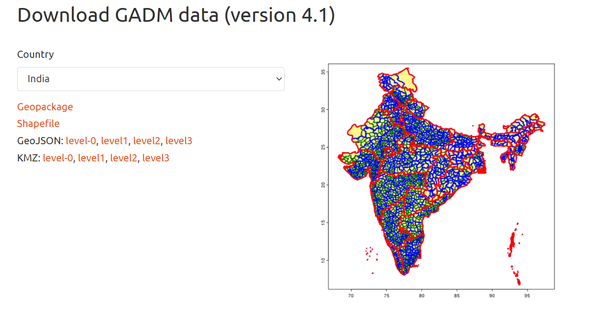
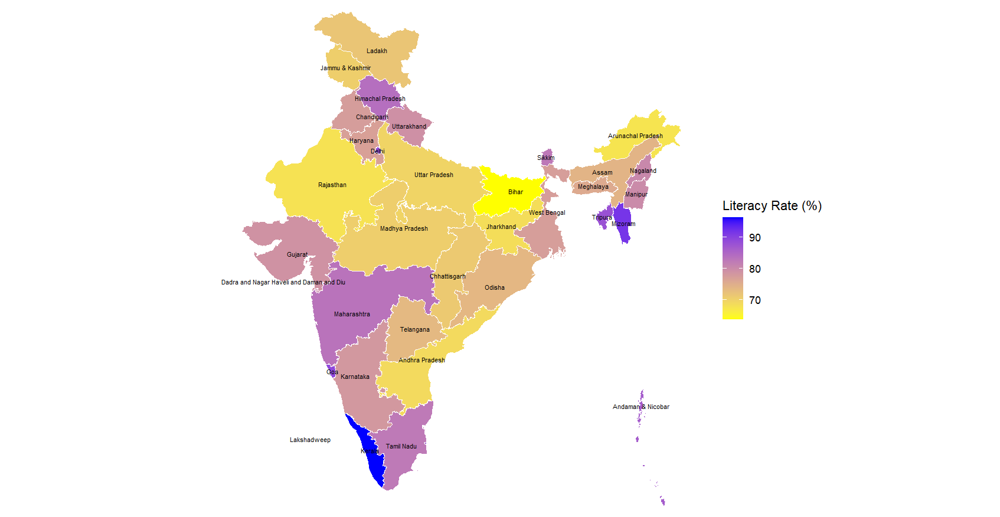

--- 
title: Mapping India in R 
description: Mapping India’s 36 Divisions Including Jammu & Kashmir and Ladakh  in R, In this example shown literacy rate.
image: '134251.png'
date: 2025-04-13 
tags: [r-programming, ggplot2] 
---



In R struggled to find a map of India that aligns with Indian government standards. GADM offer disputed territories inaccurately. Using these unofficial versions may lead to issues, especially in professional or governmental contexts.

Here's a map created using a GeoJSON file that closely follows India's official state and union territory boundaries. This example visualizes the **literacy rate** across the 36 divisions.




```r
# required libraries
library(sf)
library(ggplot2)
library(readxl)
library(dplyr)

# GeoJSON file for India states
india <- st_read("india_states.geojson")

# Read Excel literacy data
literacy_data <- read_excel("India_Literacy_Rate_By_State.xlsx")

# Merge literacy data with spatial data
india_merged <- india %>%
  left_join(literacy_data, by = c("ST_NM" = "ST_NM"))

# Transform CRS to a projected system UTM for India to avoid longitude/latitude distortions 
india_merged <- india_merged %>%
  st_transform(crs = 32643)  # UTM Zone 43N 

# Plot the map using ggplot2 
ggplot(india_merged) +
  geom_sf(aes(fill = `Literacy Rate (%)`), color = "white") +  # Fill with literacy rate
  geom_sf_text(aes(label = ST_NM), size = 2, check_overlap = TRUE) + 
  scale_fill_gradient(low = "yellow", high = "blue") +  # gradient from yellow to blue
  labs(
    title = "Map of India with Literacy Rate by State",
    fill = "Literacy Rate (%)"
  ) +
  theme_minimal() +
  theme(
    legend.position = "right",  # Position the legend to the right
    axis.text = element_blank(),  # Hide axis text
    axis.title = element_blank(),  # Hide axis titles
    panel.grid.major = element_blank(),  # Remove grid lines
    panel.grid.minor = element_blank()  # Remove minor grid lines
  )
```
 
Ensure The `ST_NM` column must match exactly in both the GeoJSON and datasets.
 