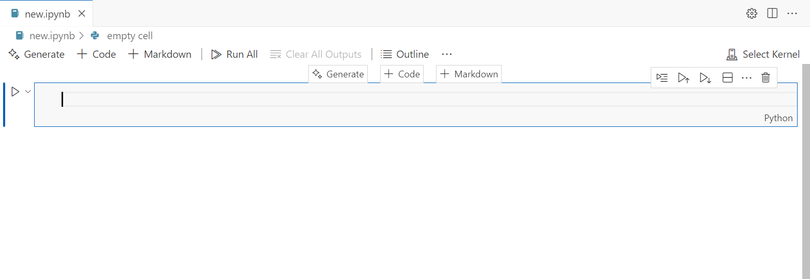
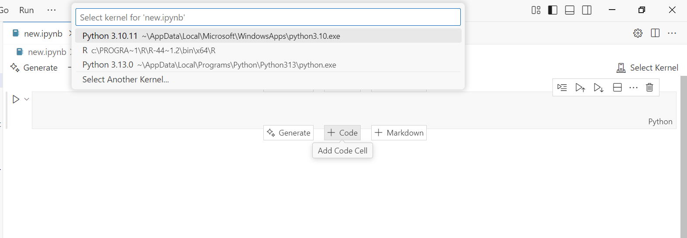
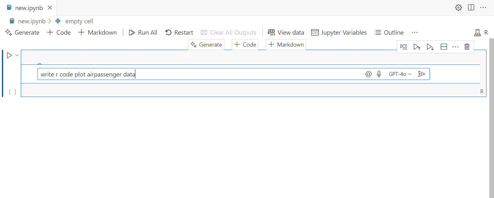
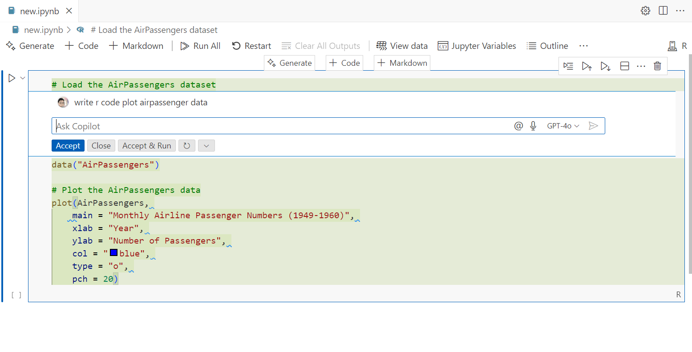
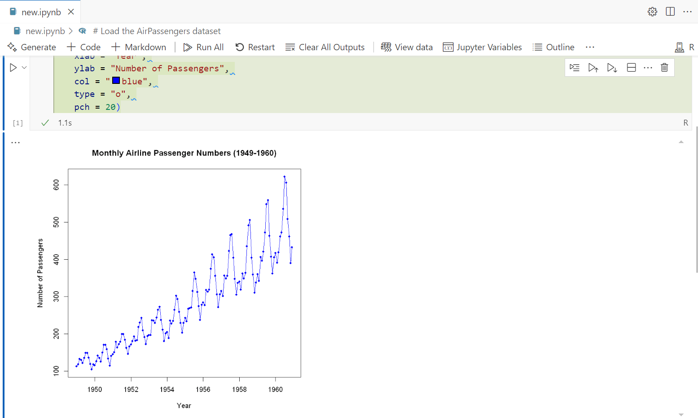
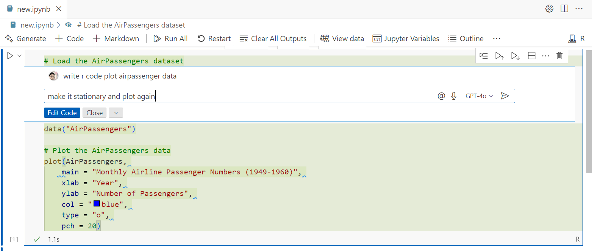
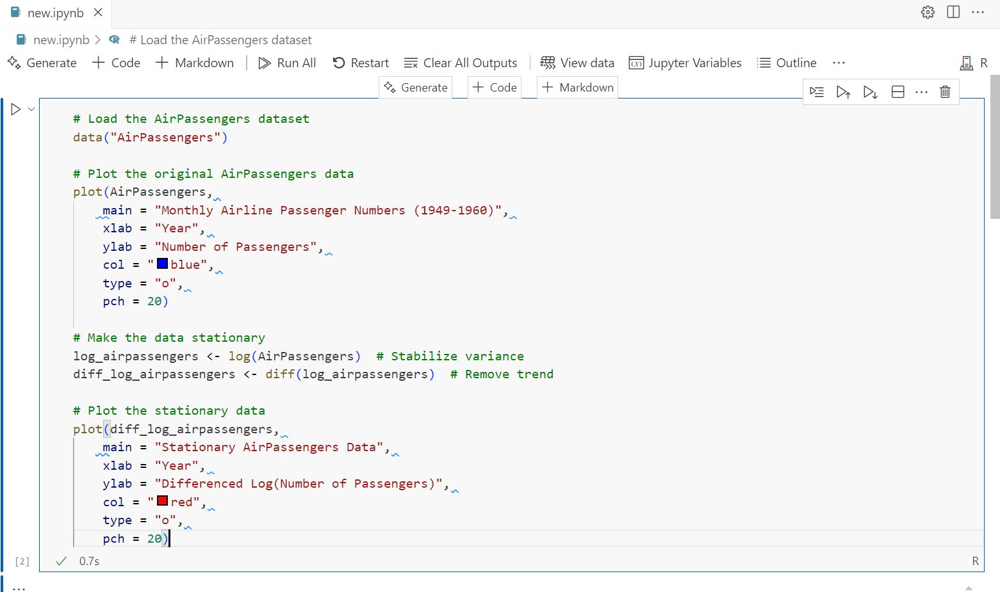

 
Hey there! If you’re diving into data science, Visual Studio Code (VS Code) is like the ultimate tool for your projects. It’s super versatile and can make your life easier by pulling together everything you need—coding, analyzing data, creating cool visuals, and even writing reports all in one place. With awesome AI intregation of  GitHub Copilot, plus support for Python, R, and Jupyter Notebooks, you can set up a workspace that’s perfect for crushing your data analysis tasks.

Copilot’s suggestions help you write better variable and function names, emit abbreviations, and even let you see at your environment variables which very handy. Plus easy fixes thanks to VS Code’s terminal, files context to copilot.

## Installing
Install VS Code, Python, R Programme and extentions  
  - Python
  - R Extension
  - Jupyter
  - GitHub Copilot
  - Data Wrangler 

Once these are installed, you’re ready to roll!

## Setting Up Python and R
If you’ve already got Python and R installed, you’re halfway there!  Now you have to sign in with your github account by clicking at copilot icon in the vs code.If done to start working with Jupyter Notebooks, create a new file with the `.ipynb` extension. Then, select your kernel (Python or R) from the top-right corner of the notebook interface in VS Code.  

## Using Jupyter Notebooks 
For example, imagine you want to visualize the classic AirPassengers dataset in R. You can start by typing a prompt like "write R code to plot AirPassengers data" in a notebook cell. Copilot might generate something like this:

 

 
 

If you want to tweak the code, you can modify the code or ask Copilot for example, you might prompt, "Make it stationary and plot"

 
 

## Prepare Report
When your analysis is ready, you can turn your Jupyter Notebook into a polished report. Use `markdown cells` to add explanations, headers, and images to document your work. 

## Wrapping Up

With VS Code Copilot, you’ve got a powerhouse setup for data science. This workflow lets you code smarter, visualize your data without worring about code, and create reports that stand out—all in one place. So, fire up VS Code, install those extensions, and dive into your data. 