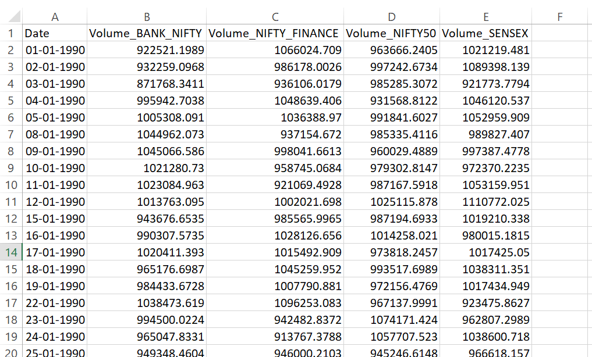
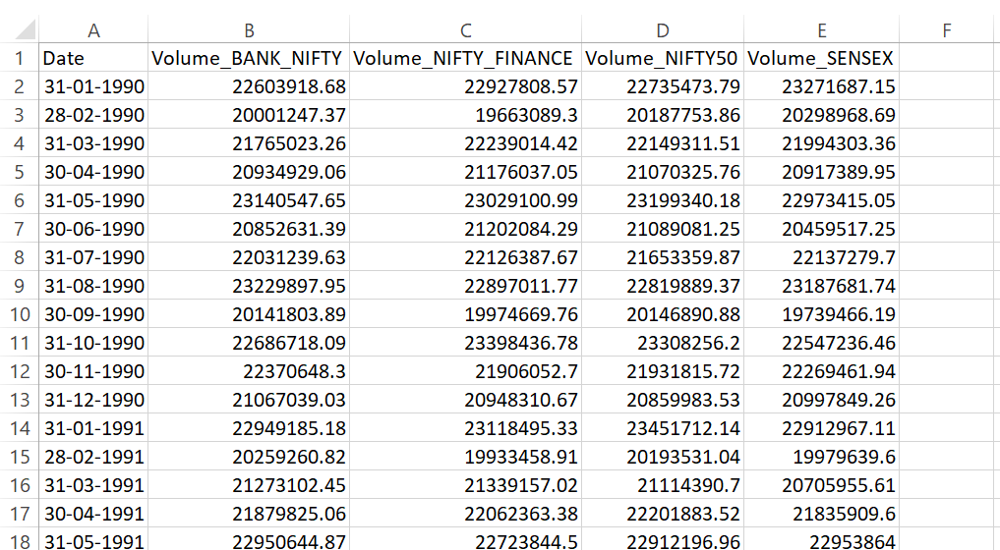

When working with time series data, it's common to deal with daily or irregular data and then convert it into more manageable chunks like monthly or yearly aggregates.  
  
Below is a snapshot of daily trading volumes for stock indices Bank Nifty, Nifty Finance, Nifty 50, and Sensex.



*Daily volumes for Bank Nifty, Nifty Finance, Nifty 50, and Sensex*
 


*Monthly trading volumes for Bank Nifty, Nifty Finance, Nifty 50, and Sensex*
 

```python
import pandas as pd

# Load the CSV 
df = pd.read_csv("daily_data.csv", parse_dates=["Date"], index_col="Date")

# Covert to monthly and sum the other cols
monthly_data = df.resample('M').sum()

print(monthly_data.head())
```

You can extend this analysis to calculate monthly averages, medians, or other aggregations. For example, mean, median, or maximum monthly trading volumes can be calculated.


```python
import pandas as pd

# Load the CSV 
df = pd.read_csv("daily_data.csv", parse_dates=["Date"], index_col="Date")

# Monthly average 
monthly_avg = df.resample('M').mean()
print("Monthly Average Volumes:")
print(monthly_avg.head())

# Monthly median 
monthly_median = df.resample('M').median()
print("\nMonthly Median Volumes:")
print(monthly_median.head())

# Monthly maximum 
monthly_max = df.resample('M').max()
print("\nMonthly Maximum Volumes:")
print(monthly_max.head())

```
