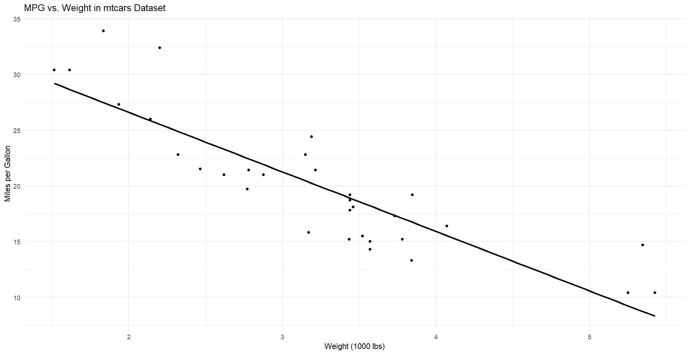

Adding a dark version of images on website can enhance the user experience, when using dark themes. Many websites implement both light and dark versions of their images, but this often requires maintaining multiple versions or using server-side image processing. 

However, this can be simplified if image is black and white, like images in documentation sites. Pure white images on dark backgrounds can appear glaring, so inverting them slightly (using invert(0.9)) can make them blend seamlessly. 

Instead of maintaining separate dark/light images, CSS filters may offer a lightweight solution.




*All are same but with filter 0, 0.9 and 1*

As it can seen, a slight inversion (0.9) often provides a more aesthetically pleasing result for dark mode than a full inversion.


## Apply to all images
In this is approach `prefers-color-scheme: dark` media query detects if the user has requested a dark color theme in their operating system or browser settings. When active, it applies the specified filter to all img elements.

```css
img{
    filter:invert(0)
}
@media (prefers-color-scheme: dark) {
img{
    filter:invert(0.9)
}
}
```


## Apply to images with class
```css 
img.dark{
    filter:invert(0.9)
} 
```

## Apply to specefic File Type 
Target images based on their file extension using CSS attribute selectors. Primarily use PNGs for diagrams and SVGs for icons that are suitable for inversion.

```css
@media (prefers-color-scheme: dark) {
img[src$=".svg"],
img[src$=".png"] {
  filter: invert(0.9);
} 
}
```

This method is handy if image file types consistently differentiate between images that should or shouldn't be inverted.


## Why This Approach Is Cool
It adds a polished, modern feel that many professional sites use without the hassle of managing multiple image versions. Light images can look out of place on dark backgrounds, especially in documentation sites where white diagrams or screenshots are common.  It only few lines of code thats it.

## Limitation
While this method is powerful, it does have a few limitations:
Its not ideal for color images, it can significantly distort colorful images. Applying filters dynamically in JavaScript can add a small overhead, especially on pages with many images.It can’t selectively invert parts of an image, only the entire image.


<style> 
img[alt$="light"] {
  filter: invert(0);
} 
img[alt$="dark"] {
  filter: invert(1);
} 
img[alt$="dark9"] {
  filter: invert(0.9);
} 
</style>