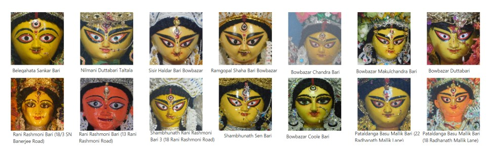

The Durga Puja festival is one of the grandest cultural carnivals in the world, celebrates
the triumph of Goddess Durga over the demon Mahishasura. Deeply rooted in Kolkata's heritage, it's a vibrant showcase of artistry, with intricately crafted Durga idols that vary across regions, artists, and time. These idols are more than spiritual symbols; reflect evolving artistic traditions, regional influences, and socio-cultural dynamics.

But have you ever wondered how similar the idols are year after year? Or how different artists maintain their unique styles? This project, "Exploring Similarity Between Durga Idols and Classifying Idol Artists Over Years: A Image-Processing Based Statistical Approach" under the supervision of Dr. Soumalya Mukhopadhyay, dives into these questions, bridging traditional craftsmanship with modern analytical technique.

## Methodology: How the Idols are Analyzed

Image Preparation: Durga idols are pretty disimilar to human faces, so standard face detection tools most of the time fail. So we manually crop idol faces to a consistent 224x224 pixel size to ensure uniformity for analysis, even if it meant some "noise and inconsistencies" due to the idols' unique structures and ornamentation

Feature Extraction: To convert images into quantifiable data, we extracted key visual "features."
HSV Color Histograms: These capture the overall color distribution, crucial for vibrant idol designs. Unlike RGB, HSV separates color from brightness, making it more robust for image analysis.
Histogram of Oriented Gradients (HOG): HOG descriptors encode texture and shape by analyzing edge directions, which are excellent for representing complex visual patterns like facial contours and ornamentation.

Feature Vector: Both the HSV color histogram (512 bins) and HOG features (6,084 features) were combined into a single, comprehensive feature vector of 6,596 elements for each idol image.
Measure Similarity: To quantify how similar two idols are Cosine Similarity is used. This metric measures the cosine of the angle between two feature vectors, with values ranging from 0 (no similarity) to 1 (perfect similarity).

Artist Prediction with SVM: To predict which artist crafted an idol, a Support Vector Machine (SVM) is employed.  This involved training the SVM on a dataset of idols and their known artists, using techniques like data augmentation (generating more versions of images) and dimensionality reduction using PCA (simplifying data) to improve accuracy.

 
## Key Findings

Assessing similarity between idols which look alike throughout decades focused on Bagbazar Sarbojanin and Kabitirtha Sarbojanin, two puja committees renowned for maintaining a consistent aesthetic over the years.

*Figure: Close-up view of Durga idol faces from Bagbazar Sarbojanin. Image courtesy of Dr. Soumalya Mukhopadhyay.*

*Figure: Close-up view of Durga idol faces from Kabitirtha Sarbojanin. Image courtesy of Dr. Soumalya Mukhopadhyay.*
 

Result: Both committees showed median similarity scores significantly greater than 0.80 (a threshold for strong similarity). This confirms a high level of consistency in their idols from 2011 to 2024, backing up the popular belief that they maintain a "lookalike" aesthetic.

Two Different Committees with "Lookalike" Idols – Are They Really So? This experiment compared idols from Bagbazar and Hazra 22 Palli, which are often perceived to have similar idol styles.

*Figure: Close-up of Durga idol faces from Hazra 22 Pally Puja. Photograph by Dr. Soumalya Mukhopadhyay.*

Result: Contrary to initial expectations of low similarity due to distinct artistic styles, the data showed a median similarity score not significantly less than 0.80, indicating a strong visual resemblance. 

North vs. South Kolkata: A Tale of Two Styles? North Kolkata is known for classical styles, while South Kolkata pioneers thematic and experimental approaches. The study sampled extensively from various zones in both regions.

Result: Despite their distinct reputations, there was no statistically significant difference in overall idol variation between North and South Kolkata. This suggests a comparable artistic diversity and uniform standards of craftsmanship across both regions remain consistent in aggregate.

Heritage House Idols (Bonedi Bari): Which Zone Has the Most Variability? Bonedi Baris (ancestral houses) are known for their vintage charm and traditional Durga Puja celebrations. The study analyzed idol consistency in these heritage homes across North, Central, and South Kolkata.

*Figure: Close-up view of Durga idol faces from selected heritage buildings of North Kolkata. Image courtesy of Dr. Soumalya Mukhopadhyay.*

*Figure: Close-up view of Durga idol faces from selected heritage buildings of Central Kolkata. Image courtesy of Dr. Soumalya Mukhopadhyay.*

*Figure: Close-up view of Durga idol faces from selected heritage buildings of South Kolkata. Image courtesy of Dr. Soumalya Mukhopadhyay.*

Result: North Kolkata showed the highest consistency, indicating uniform aesthetic traits like facial features and color palettes. 

Exploring versatility of idol artists: Who is the most versatile? Who is the most consistent? And predicting the artist of an idol based on its features using classification technique

Result: Sanatan Dinda is most versatile artist based on FSIM and Cosine Similarity measure.

Artist Prediction: The SVM classifier successfully demonstrated the feasibility of predicting an idol's artist based on its visual features. With HOG features, PCA, and data augmentation, the model achieved a high overall accuracy of 97% in classifying artists. Even with minor misclassifications, the model performed very well in distinguishing between different artists' unseen works.

By amalgamating the strength of scientific methods with the essence of art and aesthetics, this project offers a unique lens into Kolkata's rich cultural heritage.

