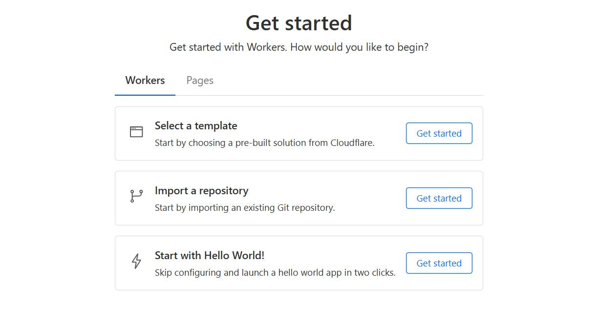

 

First off, why even bother with a page view counter? For me, it’s about curiosity how many folks are checking out plus it’s cool to show those numbers on a blog! Whether you’re have a personal site or a small project, a counter gives you a quick pulse on engagement without needing an analytics suite. Using Cloudflare Workers and D1 database we can make a simple, serverless counter and integrates easily with any webpage. We’ll create a Worker to count and retrieve page views, store data in a D1 database, and display the count on pages. To avoid spams we implement CORS restrictions ensure works only on specific origins. We can also make sure no multiple increment for same user locally.

Deployment can be done direct file and code , or connecting github repo which better managable code .

## Create D1 Database 
Install Wrangler and create a D1 database named `view-counter-db`. Create a ViewCounter table with `url` and `count` columns.
```bash
npm install -g wrangler
wrangler login
wrangler d1 create view-counter-db
wrangler d1 execute view-counter-db --command="CREATE TABLE ViewCounter (url TEXT PRIMARY KEY, count INTEGER NOT NULL)"
```


## Write Worker Code

Create index.ts for the Worker. It handles the `/?url=<page-url>` endpoint to increment and return the view count, with CORS restricted to allowed origins.


```ts
export interface Env {
  DB: D1Database;
}

export default {
  async fetch(request: Request, env: Env): Promise<Response> {
    const url = new URL(request.url);
    const pageUrl = url.searchParams.get('url');

    const allowedOrigins = [
      'http://localhost:8000', 
      'http://localhost:4000', 
      'https://your-username.github.io',
    ];

    const origin = request.headers.get('Origin');
    const corsHeaders = origin && allowedOrigins.includes(origin)
      ? {
          'Access-Control-Allow-Origin': origin,
          'Access-Control-Allow-Methods': 'GET, OPTIONS',
          'Access-Control-Allow-Headers': 'Content-Type',
          'Content-Type': 'application/json',
        }
      : { 'Content-Type': 'application/json' };

    if (request.method !== 'OPTIONS' && origin && !allowedOrigins.includes(origin)) {
      return new Response(JSON.stringify({ error: 'Origin not allowed' }), { status: 403, headers: corsHeaders });
    }

    if (request.method === 'OPTIONS') {
      return new Response(null, { status: 204, headers: corsHeaders });
    }

    if (!pageUrl) {
      return new Response(JSON.stringify({ error: 'URL parameter is required' }), { status: 400, headers: corsHeaders });
    }

    try {
      const { results } = await env.DB.prepare('SELECT count FROM ViewCounter WHERE url = ?').bind(pageUrl).all();
      if (results.length === 0) {
        await env.DB.prepare('INSERT INTO ViewCounter (url, count) VALUES (?, 1)').bind(pageUrl).run();
        return new Response(JSON.stringify({ url: pageUrl, count: 1 }), { headers: corsHeaders });
      } else {
        await env.DB.prepare('UPDATE ViewCounter SET count = count + 1 WHERE url = ?').bind(pageUrl).run();
        const updated = await env.DB.prepare('SELECT count FROM ViewCounter WHERE url = ?').bind(pageUrl).first();
        return new Response(JSON.stringify({ url: pageUrl, count: updated.count }), { headers: corsHeaders });
      }
    } catch (error) {
      return new Response(JSON.stringify({ error: 'Database error', details: error.message }), { status: 500, headers: corsHeaders });
    }
  },
};
```

## Configure Worker

Create `wrangler.toml` to link the Worker to the D1 database using the database UUID from the creation step.


```toml
name = "page-view-counter"
compatibility_date = "2025-07-21"
main = "index.ts"

[[d1_databases]]
binding = "DB"
database_name = "view-counter-db"
database_id = "YOUR_DATABASE_UUID"
```

Replace `YOUR_DATABASE_UUID` with the UUID from `wrangler d1 create`.
 
## Deploy Worker 
Now deploy the worker js and get the endpoint and implement in any page to check if working. 
 


## Add the Counter to Website
Here’s a simple example to show the view count on any page:

```html 
<div id="view-count">Views: Loading...</div>

<script>
  const workerUrl = 'https://your-worker-subdomain.workers.dev';
  const pageUrl = window.location.href;

  const viewCountEl = document.getElementById('view-count');

  if (viewCountEl) {
    fetch(`${workerUrl}/?url=${encodeURIComponent(pageUrl)}`)
      .then(response => {
        if (!response.ok) throw new Error(`HTTP error! status: ${response.status}`);
        return response.json();
      })
      .then(data => {
        if (data.error) throw new Error(data.error);
        viewCountEl.textContent = `Views: ${data.count}`;
      })
      .catch(error => {
        console.error('Error fetching view count:', error);
        viewCountEl.classList.add('error');
        viewCountEl.textContent = `Views: Error (${error.message})`;
      });
  }
</script>
```

## Prevent Repeat Counts
To keep things simple and privacy-friendly, we can prevent repeat view increments using the browser’s localStorage. When a user visits a page, we store the view timestamp locally and only allow a new count after a certain amount of time.

```html
<div id="view-count">Views: Loading...</div>

<script>
  const workerUrl = 'https://your-worker-subdomain.workers.dev';
  const pageUrl = window.location.href;
  const viewCountEl = document.getElementById('view-count');

  // Unique key for this page in localStorage
  const storageKey = `viewed-${pageUrl}`;
  const cooldownHours = 12;

  function shouldSendViewRequest() {
    const lastViewed = localStorage.getItem(storageKey);
    if (!lastViewed) return true;

    const lastTime = new Date(parseInt(lastViewed, 10));
    const now = new Date();
    const hoursPassed = (now - lastTime) / (1000 * 60 * 60);
    return hoursPassed >= cooldownHours;
  }

  if (viewCountEl) {
    if (shouldSendViewRequest()) {
      fetch(`${workerUrl}/?url=${encodeURIComponent(pageUrl)}`)
        .then(response => {
          if (!response.ok) throw new Error(`HTTP error! status: ${response.status}`);
          return response.json();
        })
        .then(data => {
          if (data.error) throw new Error(data.error);
          viewCountEl.textContent = `Views: ${data.count}`;
          localStorage.setItem(storageKey, Date.now().toString());
        })
        .catch(error => {
          console.error('Error fetching view count:', error);
          viewCountEl.classList.add('error');
          viewCountEl.textContent = `Views: Error (${error.message})`;
        });
    } else {
      // Optionally fetch the current count without incrementing
      // Or just show a static message until cooldown ends
      viewCountEl.textContent = `Views: Recently viewed`;
    }
  }
</script>
```

Else we can 
## Add Non-Incrementing Endpoint 
If you want to separate read-only vs increment logic, you could extend your Worker with a GET /count-only?url=... endpoint that only fetches the current count without increasing it.