The Ames Housing Dataset, created by Dean De Cock, is a dataset used in the Kaggle competition House Prices - Advanced Regression Techniques. It contains 81 features that describe different aspects of houses in Ames. The main goal is to predict the Sale Price of the houses. In this project Ihave performed exploratory data analysis (EDA), feature engineering, handling of missing data and outliers, regression assumptions, and applied multiple linear regression ridge regression and Lasso regression models. I have also discuss the theoretical underpinnings and assumptions of these models to provide a understanding. Its hard to make a app using lots of features so I have selected few features which have strong relation with target variable sales price and fit a linear regression and deployed to streamlit app.

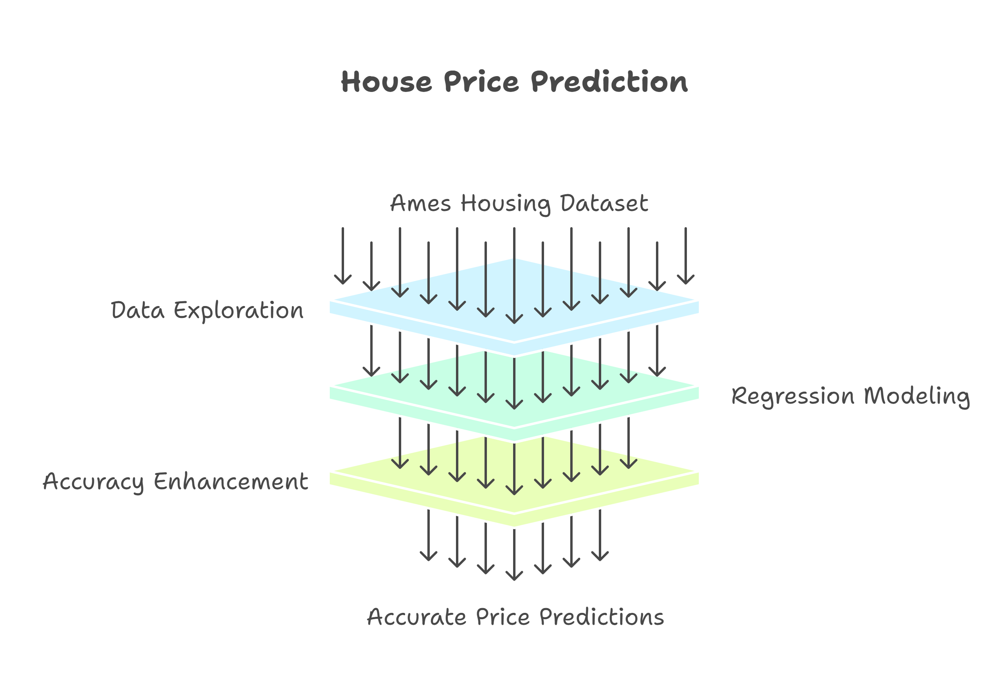  


## Why This Approach?
The dataset’s complexity—81 features with missing values, skewed distributions, and potential multicollinearity—demands a systematic approach. My strategy emphasizes:
- **Thorough EDA**: To uncover relationships and distributions, guiding feature selection as all features are not very important and some may be utilized through others.
- **Robust Preprocessing**: To handle missing data and outliers while preserving data integrity.
- **Regression Assumptions**: To ensure models meet linearity, normality, and homoscedasticity requirements.
- **Model Selection**: Combining multiple linear regression for interpretability with Ridge and Lasso regression for feature selection and regularization.

This approach balances predictive accuracy with interpretability of variables and usability of models, addressing challenges like skewness, multicollinearity, and overfitting.

## Theoretical Background and Regression Assumptions
Linear regression models rely on several key assumptions:

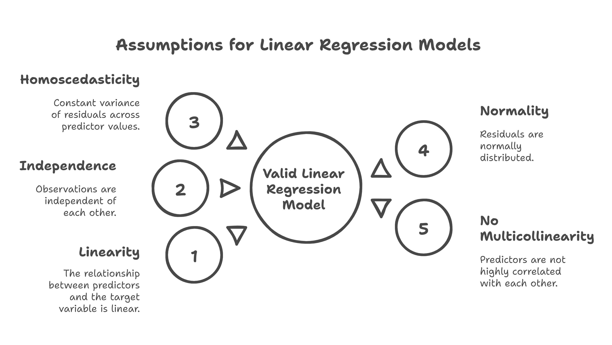
*Assumptions of rgression model: linearity, independence, homoscedasticity, normality of residuals, and no multicollinearity.*

1. **Linearity**: The relationship between predictors and the target variable is linear.
2. **Independence**: Observations are independent of each other.
3. **Homoscedasticity**: Constant variance of residuals across predictor values.
4. **Normality**: Residuals are normally distributed.
5. **No Multicollinearity**: Predictors are not highly correlated with each other.

Violations of these assumptions can lead to biased or inefficient models. For instance, skewed target variables violate normality, and multicollinearity can inflate variance in coefficient estimates. I addressed these through transformations, feature selection, and regularization techniques like Lasso.

## Exploratory Data Analysis 
EDA is critical for understanding the dataset’s structure and identifying key predictors. The dataset comprises 81 columns, including numerical (e.g., `GrLivArea`, `TotalBsmtSF`) ordinal and nominal (e.g., `Neighborhood`, `GarageType`) features.

#### Key Observations:
- **SalePrice Distribution**:

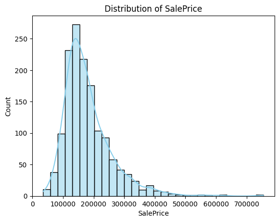

  - Mean: ~$180,921$; Median: $163,000$, indicating right skewness (confirmed by skewness: ~1.88, kurtosis: ~6.53).
  - A histogram and Q-Q plot showed deviation from normality, necessitating transformation.

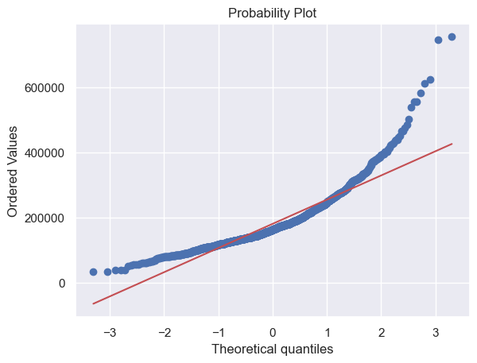


- **Feature Relationships**:
  - **GrLivArea**: Scatter plots revealed a strong linear relationship with SalePrice.

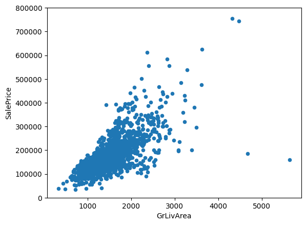


  - **TotalBsmtSF**: Exhibited a slight exponential relationship, suggesting potential non-linearity.

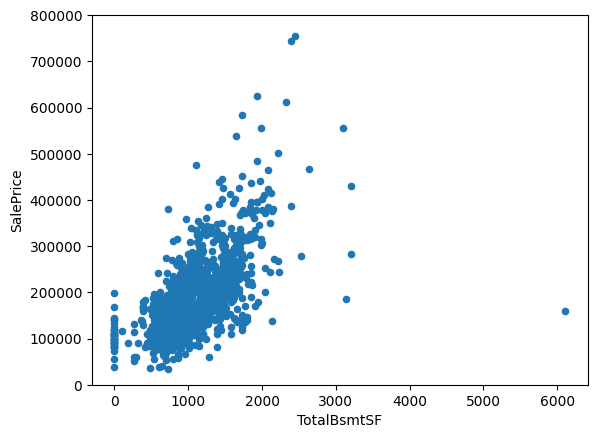


  - **OverallQual**: Box plots confirmed that higher-quality houses command higher prices.

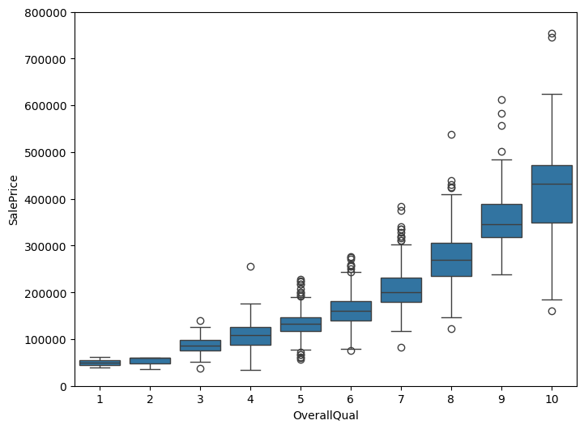


  - **TotRmsAbvGrd**: More rooms correlated with higher prices, as shown in box plots.

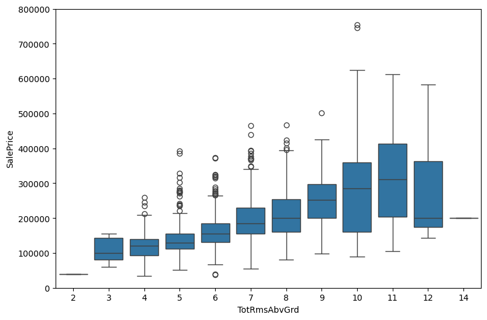


- **Correlation Analysis**:
  - A heatmap of the top 10 correlated features (using `np.corrcoef`) highlighted `OverallQual`, `GrLivArea`, `GarageCars`, and `TotalBsmtSF` as top predictors.
  - `GarageCars` and `GarageArea` were highly correlated, indicating potential multicollinearity.

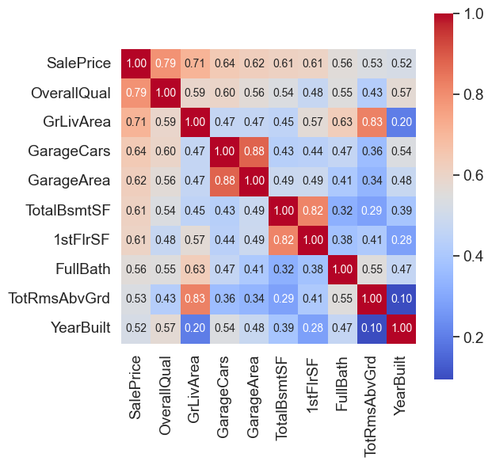
 
## Handling Missing Data
Missing data was prevalent, with some features missing over 15% of values. My strategy:

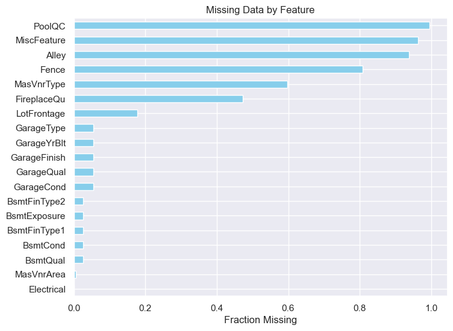

- **High Missingness (>15%)**: Dropped features like `Alley` and `PoolQC`, as imputation could introduce bias.
- **Categorical Features**: For features like `GarageType`, missing values were interpreted as "no garage" and filled with `None`.
- **Numerical Features**: Imputed with median (e.g., `LotFrontage`) or mean, depending on distribution.
 
 
```output
              Total   Percent
PoolQC         1453  0.995205
MiscFeature    1406  0.963014
Alley          1369  0.937671
Fence          1179  0.807534
MasVnrType      872  0.597260
FireplaceQu     690  0.472603
LotFrontage     259  0.177397
GarageYrBlt      81  0.055479
GarageCond       81  0.055479
GarageType       81  0.055479
GarageFinish     81  0.055479
GarageQual       81  0.055479
BsmtExposure     38  0.026027
BsmtFinType2     38  0.026027
BsmtCond         37  0.025342
BsmtQual         37  0.025342
BsmtFinType1     37  0.025342
MasVnrArea        8  0.005479
Electrical        1  0.000685
```

## Outlier Detection and Removal
Outliers can distort regression models. I identified two extreme outliers in `GrLivArea` (>4000 square feet, low `SalePrice`) and removed them, reducing the training set to 1456 rows. Standardization using `StandardScaler` and scatter plots confirmed their impact.

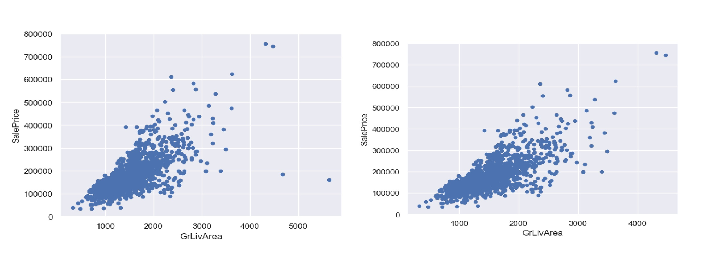
*Removed the outlier*

### Feature Transformations
 
- **Handling Zeros in TotalBsmtSF**:
  - Created a binary variable `HasBsmt` to indicate basement presence, avoiding `log(0)` issues.
  - Code:
    ```python
    train['HasBsmt'] = (train['TotalBsmtSF'] > 0).astype(int)
    train.loc[train['HasBsmt'] == 1, 'TotalBsmtSF'] = np.log(train['TotalBsmtSF'])
    ```

### Feature Engineering
To capture non-linear relationships:
- **Polynomial Features**: Created `OverallQual^2`, `OverallQual^3`, `GrLivArea^2`, etc.
- **Simplified Features**: Consolidated categorical variables (e.g., `SimplOverallQual`) to reduce dimensionality.
- **Numerical vs. Categorical Split**: Identified 36 numerical features (19 continuous, 13 discrete) and 26 categorical features.

## Taking Transformation

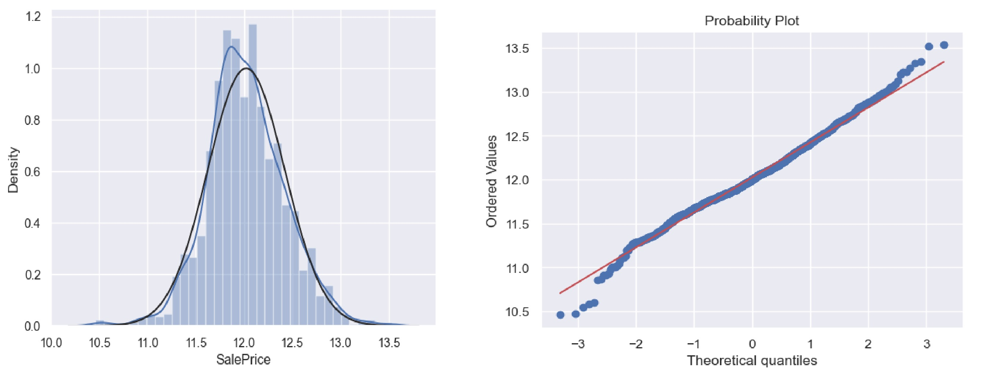
*Sales price after taking log*

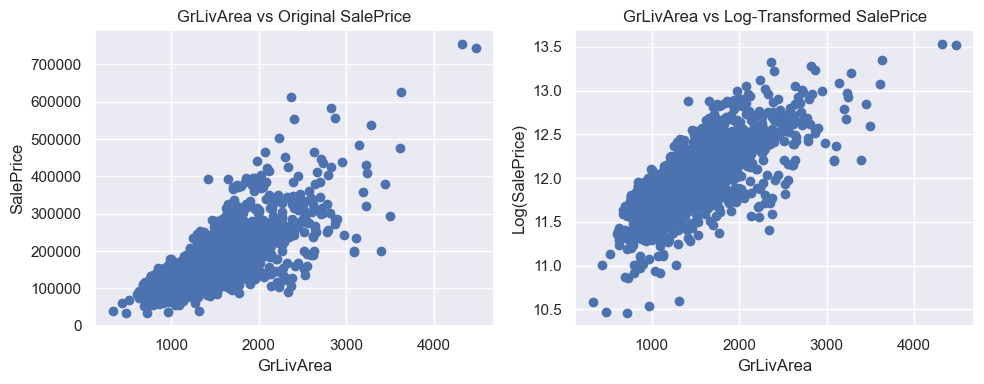

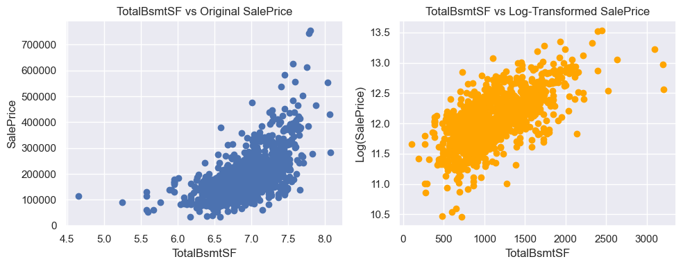

 
### Multicollinearity Check (VIF)
```output
VIF values:
       Feature        VIF
0    Intercept  21.075941
1  OverallQual   2.122960
2    GrLivArea   1.605156
3   GarageCars   1.670124
4  TotalBsmtSF   1.477056
```

VIF results show that all selected features have VIF values well below 5, indicating low multicollinearity.


## Model Fitting
I implemented three models: Multiple Linear Regression Ridge Regression and Lasso Regression. For better usability and interpritability we will fit a MLR using this selected feature. Then fit Ridge and Lesso using all usable variables and compare them.

### Multiple Linear Regression
- **Features**: `OverallQual`, `GrLivArea`, `GarageCars`, `TotalBsmtSF`.
- **Process**:
  - Standardized features using `StandardScaler`.
  - Split data (80% train, 20% test).
  - Fitted using `sklearn.linear_model.LinearRegression`.
- **Results**:
  - Training RMSE: 0.384
  - R² on Training Set: 0.9456
  - R² on Test Set: 0.8923
  - Residuals were normally distributed, as shown in histograms and Q-Q plots.

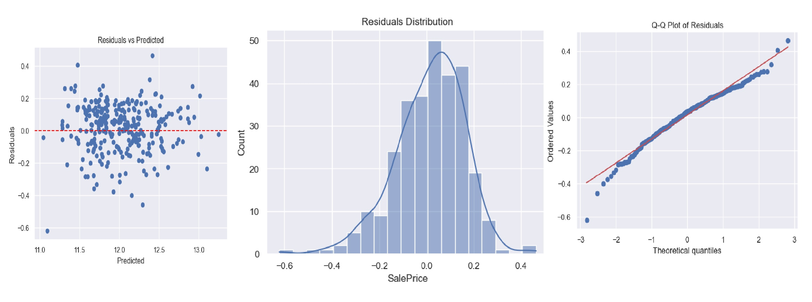
*Residual plots*
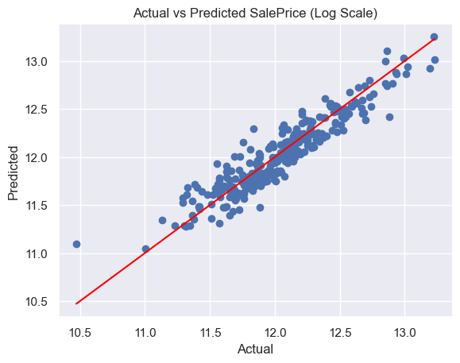
*Actual vs Predicted SalePrice (Log Scale)*
 
This model is deployed. You can try it. 
[](https://house-price-prediction-mrinalcs.streamlit.app/) 


### Ridge Regression

- **Features**: Ridge retained **316 features**, eliminating only **3** features due to its L2 regularization nature which shrinks but does not fully zero out coefficients.
  
- **Process**:
  - Initial grid search indicated best `alpha = 30.0`, but further fine-tuning for precision centered around 30 led to a better result.
  - Final selected `alpha = 24.0`. 

- **Results**:
  - **Training RMSE**: 0.1154  
  - **Test RMSE**: 0.1164  
  - **R² on Training Set**: 0.9396  
  - **R² on Test Set**: 0.9223  
  - **Key Coefficients**: While Ridge keeps all variables (with small coefficients), most influential ones (by absolute magnitude) include:
    - `OverallQual`
    - `GrLivArea-Sq`
    - `Neighborhood_NridgHt`, `Neighborhood_Crawfor`

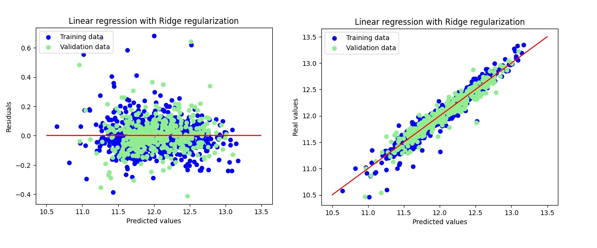

 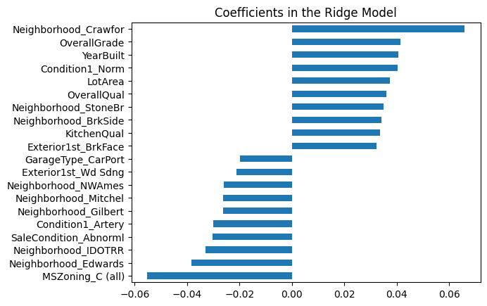


### Lasso Regression
- **Features**: Lasso selected 111 features, eliminating 208 others.
- **Process**:
  - Used cross-validation to select `alpha = 0.0006`.
  - Plotted residuals and coefficients.
- **Results**:
  - Training RMSE: 0.1141
  - Test RMSE: 0.1158
  - R² on Training Set: 0.9388
  - R² on Test Set: 0.9282
  - Key coefficients: `Neighborhood_Crawfor`, `GrLivArea-Sq`, `OverallGrade`.

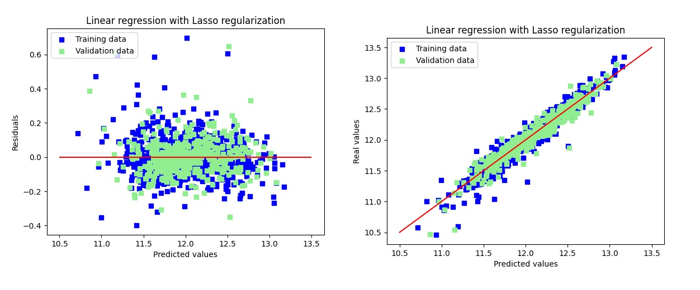

 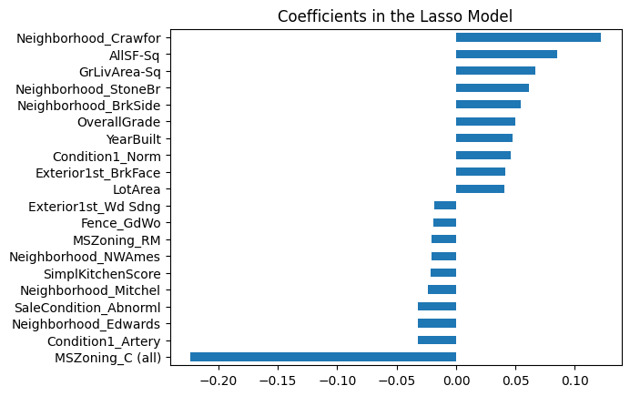

  
## Model Performance Summary

| Model  | RMSE Train | RMSE Test | R² Train | R² Test | Adjusted R² Train | Adjusted R² Test |
|--------|------------|-----------|----------|---------|-------------------|------------------|
| Linear | 0.007      | 0.016     | 0.955    | 0.899   | 0.934             | 0.625            |
| Ridge  | 0.009      | 0.012     | 0.940    | 0.922   | 0.912             | 0.711            |
| Lasso  | 0.010      | 0.011     | 0.939    | 0.928   | 0.911             | 0.733            |

## Conclusion
The Ames Housing Dataset posed challenges like missing data, skewed distributions, and multicollinearity, which I addressed through systematic EDA, feature engineering, and transformation. Ridge and Lasso regression outperformed multiple linear regression due to its feature selection and regularization, achieving an R² of 0.9282 on the test set. This project underscores the importance of validating regression assumptions and tailoring preprocessing to the dataset’s characteristics. For the full code, refer to the notebook.

[](https://github.com/mrinalcs/House-Price-Prediction/blob/main/notebook.ipynb)
