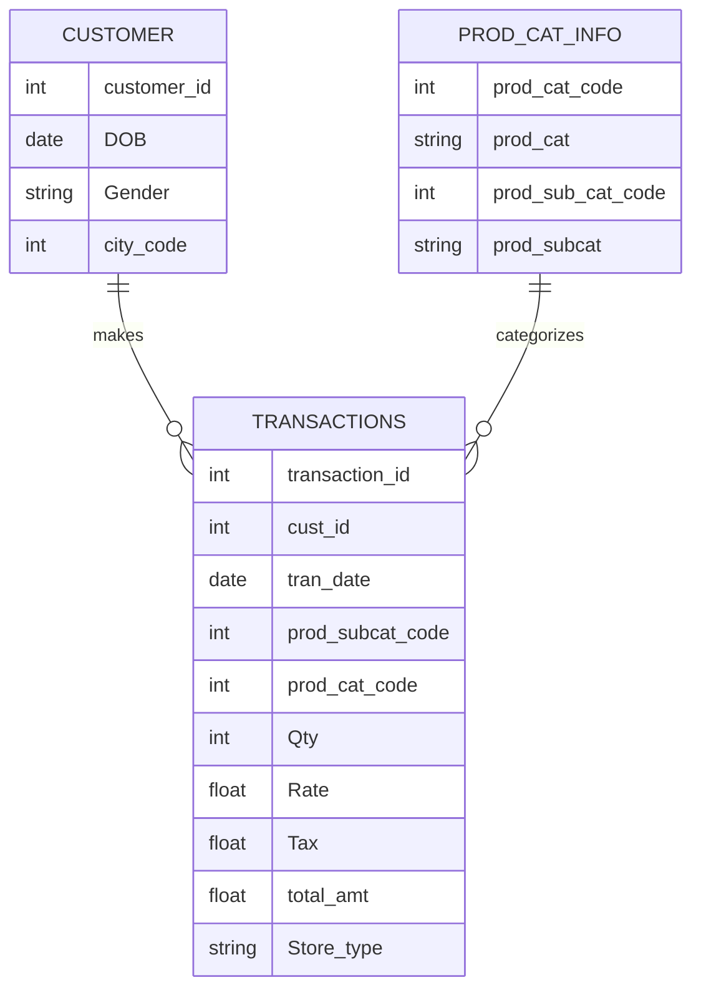

In today’s competitive retail market, understanding customer behavior, product performance, and sales trends is critical for business growth. In this case study, we use SQL to analyze retail data from three tables:

Customer → Contains customer demographics\
Transactions → Tracks purchase details and revenue\
Product Category Info → Maps products to categories and subcategories 

We'll answer 15 real-world business questions using SQL queries and explain the insights step by step.




## Business Questions & SQL Solutions
### Q1. What is the total number of rows in each table?

We have to validate dataset size before analysis. We count the total rows from all three tables using a single query with UNION ALL. Knowing dataset size helps us to plan analysis strategy and optimize queries.


```sql
SELECT 'Customer' AS Table_Name, COUNT(*) AS Total_Rows FROM Customer
UNION ALL
SELECT 'Transactions', COUNT(*) FROM Transactions
UNION ALL
SELECT 'Product Category', COUNT(*) FROM Prod_Cat_Info;
```


### Q2. How many transactions are returns?

To find how many products were returned. Returns are recorded as negative quantities. We count rows where `Qty < 0` . A high return rate signals product quality issues or customer dissatisfaction.

```sql
SELECT COUNT(*) AS Total_Return_Transactions
FROM Transactions
WHERE Qty < 0;
```


### Q3. Convert all date columns into a valid format

Objective: Standardize date formats before analysis. `CONVERT(DATE, column, 105)` converts inconsistent formats into proper DATE type. Ensures smooth calculations for age, sales trends, and time periods.
```sql
SELECT customer_id, CONVERT(DATE, DOB, 105) AS Formatted_DOB FROM Customer;
SELECT transaction_id, CONVERT(DATE, tran_date, 105) AS Formatted_Tran_Date FROM Transactions;
```


### Q4. What is the time range of the transaction data?

Find start date, end date, and duration of available data.

```sql
SELECT 
    MIN(CONVERT(DATE, tran_date, 105)) AS Start_Date,
    MAX(CONVERT(DATE, tran_date, 105)) AS End_Date,
    DATEDIFF(DAY, MIN(CONVERT(DATE, tran_date, 105)), MAX(CONVERT(DATE, tran_date, 105))) AS Total_Days,
    DATEDIFF(MONTH, MIN(CONVERT(DATE, tran_date, 105)), MAX(CONVERT(DATE, tran_date, 105))) AS Total_Months,
    DATEDIFF(YEAR, MIN(CONVERT(DATE, tran_date, 105)), MAX(CONVERT(DATE, tran_date, 105))) AS Total_Years
FROM Transactions;
```
 
Uses MIN and MAX to get earliest and latest transaction dates. Calculates total days, months, and years available for analysis. Important for seasonality analysis and year-over-year trends.


### Q5. Which category does the sub-category “DIY” belong to?
We have to finds the parent category of a given subcategory.This is useful for product mapping and subcategory-level sales tracking.

```sql
SELECT prod_cat 
FROM Prod_Cat_Info
WHERE prod_subcat = 'DIY';
```


---

### Q6. Which channel is most frequently used for transactions?
Our objective is to identify the most popular sales channel. We can groups transactions by `Store_Type`. Returns the highest transaction volume channel. It helps allocate marketing budgets and inventory effectively.

```sql
SELECT TOP 1 Store_Type, COUNT(*) AS Total_Transactions
FROM Transactions
GROUP BY Store_Type
ORDER BY Total_Transactions DESC;
```
 

### Q7. What is the count of male and female customers?


```sql
SELECT Gender, COUNT(*) AS Total_Customers
FROM Customer
GROUP BY Gender;
```


### Q8. From which city do we have the maximum customers?
We can groups customers by `city_code` and returns the city with highest customer concentration.

```sql
SELECT TOP 1 city_code, COUNT(*) AS Total_Customers
FROM Customer
GROUP BY city_code
ORDER BY Total_Customers DESC;
```


### Q9. Find total revenue for Electronics and Books
 
Retailers need to know which product categories generate the most income.
In this query, I wanted to find the total revenue made from the Electronics and Books categories. I joined the **Transactions** table with **Prod_Cat_Info** so that I could get the product category names. Then, I used a `WHERE` condition to keep only the rows where the category is either Books or Electronics. Finally, I grouped the results by category and calculated the total revenue for each using `SUM(Total_Amt)`.

```sql
SELECT PCI.prod_cat, SUM(CAST(Total_Amt AS FLOAT)) AS Total_Revenue
FROM Transactions T
JOIN Prod_Cat_Info PCI
ON T.prod_cat_code = PCI.prod_cat_code
   AND T.prod_subcat_code = PCI.prod_sub_cat_code
WHERE PCI.prod_cat IN ('BOOKS', 'ELECTRONICS')
GROUP BY PCI.prod_cat;
```


### Q10. Find combined revenue for Electronics and Clothing at flagship stores

To solve this, I wanted to check the total revenue for Electronics and Clothing categories, but only from flagship stores. For that, I joined the **Transactions** table with **Prod_Cat_Info** to get the category details. Then, I used a `WHERE` condition to select only the rows where the store type is ‘FLAGSHIP STORE’ and the product category is either Clothing or Electronics. Finally, I grouped the results by product category and calculated the total revenue using `SUM(Total_Amt)` for each.

```sql
SELECT prod_cat, SUM(CAST(Total_Amt AS FLOAT)) AS Total_Revenue
FROM Transactions T
JOIN Prod_Cat_Info PCI
ON T.prod_cat_code = PCI.prod_cat_code
   AND T.prod_subcat_code = PCI.prod_sub_cat_code
WHERE Store_Type = 'FLAGSHIP STORE'
AND prod_cat IN ('CLOTHING', 'ELECTRONICS')
GROUP BY prod_cat;
```


### Q11. Find top 5 product subcategories by sales & return percentage 

To solve this, I wanted to find the top 5 product subcategories that sell the most and also see how much they contribute to returns. I joined the **Transactions** table with **Prod_Cat_Info** to get the subcategory names. Then, I calculated the **total sales** for each subcategory using `SUM(Total_Amt)` and worked out the **sales percentage** by comparing each subcategory’s sales with the total sales. For returns, I used a `CASE` statement to add up only the negative quantities (returns) and then calculated their percentage of total returns. Finally, I grouped the results by subcategory and picked the top 5 based on sales.


```sql
SELECT TOP 5 PCI.prod_subcat,
    SUM(CAST(Total_Amt AS FLOAT)) AS Total_Sales,
    SUM(CAST(Total_Amt AS FLOAT)) * 100.0 / (SELECT SUM(CAST(Total_Amt AS FLOAT)) FROM Transactions) AS Sales_Percentage,
    SUM(CASE WHEN Qty < 0 THEN Qty ELSE 0 END) * 100.0 / (SELECT SUM(Qty) FROM Transactions WHERE Qty < 0) AS Return_Percentage
FROM Transactions T
JOIN Prod_Cat_Info PCI
ON T.prod_cat_code = PCI.prod_cat_code
   AND T.prod_subcat_code = PCI.prod_sub_cat_code
GROUP BY PCI.prod_subcat
ORDER BY Total_Sales DESC;
```

This identifies best-selling products and highlights categories causing most returns.


### Q12. Find customers who made more than 10 purchases

To identify customers who were frequent buyers, I analyzed the **Transactions** table. I grouped the data by `Cust_Id` so that all purchases made by each customer could be aggregated. Next, I counted the total number of transactions for each customer using the `COUNT(*)` function, while ensuring only valid purchases were considered by adding the condition `WHERE Qty > 0`. Finally, I used the `HAVING` clause to filter only those customers whose transaction count exceeded 10, giving me the list of customers who made more than 10 purchases.


```sql
SELECT Cust_Id, COUNT(*) AS Total_Transactions
FROM Transactions
WHERE Qty > 0
GROUP BY Cust_Id
HAVING COUNT(*) > 10;
```


### Q13. Find the store type with the highest sales and transactions

To solve this, I needed to determine which store type performed the best in terms of revenue and transactions. Since both pieces of information are available in the **Transactions** table, I grouped the records by `Store_Type`. Then, I calculated the **total sales** using the `SUM()` function on `Total_Amt` and counted the **total number of transactions** using `COUNT(*)`. Finally, I sorted the results in descending order of sales with `ORDER BY Total_Sales DESC` and used `TOP 1` to select only the store type with the highest overall sales and corresponding transaction count.

```sql
SELECT TOP 1 Store_Type,
       SUM(CAST(Total_Amt AS FLOAT)) AS Total_Sales,
       COUNT(*) AS Total_Transactions
FROM Transactions
GROUP BY Store_Type
ORDER BY Total_Sales DESC;
```


### Q14. Find product categories with above-average revenue

To approach this problem, I needed to find which product categories generated revenue higher than the overall average revenue. For this, I joined the Transactions table with `Prod_Cat_Info` so that each transaction could be linked to its respective product category. Then, I calculated the average revenue per category using the `AVG()` function on `Total_Amt` . To filter only those categories performing above the overall average, I used the HAVING clause with a subquery that calculates the average revenue across all transactions. Finally, the query returns only those product categories whose average revenue is greater than this overall benchmark.

```sql
SELECT PCI.prod_cat, 
       AVG(CAST(Total_Amt AS FLOAT)) AS Avg_Revenue
FROM Transactions T
JOIN Prod_Cat_Info PCI
ON T.prod_cat_code = PCI.prod_cat_code
   AND T.prod_subcat_code = PCI.prod_sub_cat_code
GROUP BY PCI.prod_cat
HAVING AVG(CAST(Total_Amt AS FLOAT)) >
       (SELECT AVG(CAST(Total_Amt AS FLOAT)) FROM Transactions);
```


### Q15. Find average and total revenue by subcategory for top categories

To solve this, I first identified that the Transactions table contains the sales amounts while the `Prod_Cat_Info` table contains the category and subcategory details. Since the revenue had to be grouped by subcategory within each top category, I joined both tables using the matching prod_cat_code and prod_subcat_code. Then, I calculated the average sales using AVG(), the total revenue using `SUM()` , and also counted the number of transactions with `COUNT(*)` . Finally, I grouped the results by prod_cat and prod_subcat to get values at the category–subcategory level and ordered them in descending order of total sales to highlight the top-performing categories.

```sql
SELECT prod_cat, prod_subcat,
       AVG(CAST(Total_Amt AS FLOAT)) AS Avg_Sales,
       SUM(CAST(Total_Amt AS FLOAT)) AS Total_Sales,
       COUNT(*) AS Total_Transactions
FROM Transactions T
JOIN Prod_Cat_Info PCI
ON T.prod_cat_code = PCI.prod_cat_code
   AND T.prod_subcat_code = PCI.prod_sub_cat_code
GROUP BY prod_cat, prod_subcat
ORDER BY Total_Sales DESC;
```


 