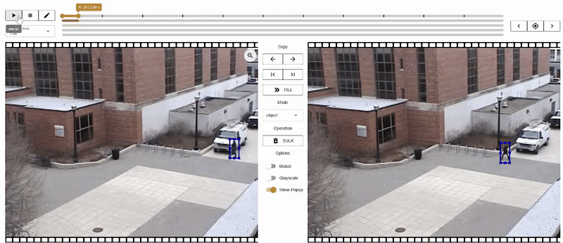

--- 
title: "VIDAT Video Annotation Tool" 
description: "A Fast, Offline, Open-Source Video Annotation Tool introduction It is an efficient offline video annotation tool designed for building datasets for object detection, tracking, and other computer vision applications"
date: 2025-11-25 
last_modified_at: 2025-11-25 
tags: [open-source, computer-vision, video-analytics] 
image: '251125.jpg'
---
 
During my internship at IDEAS, my guide introduced me to VIDAT (Video Annotation Tool) — and it quickly became one of my favorite discoveries. If you've ever struggled with setting up complex annotation software, VIDAT feels like a breath of fresh air. It's lightweight, browser-based, and runs completely offline, making it one of the easiest tools I've worked with.
 
## What Is VIDAT?

VIDAT is an open-source annotation tool developed by **ANU CVML**. It's designed for computer vision tasks where you need to label video frames with precision. Whether you're working on object detection, segmentation, or pose estimation, VIDAT has you covered.

Here's what makes it stand out:
 
- **No installation required**: Just host it locally or use deployed one and open in your browser. Offline support perfect for secure environments or limited internet access.
- **Interpolation feature**: Annotate key frames and let VIDAT automatically generate annotations for intermediate frames saving huge amounts of time. 
- **Flexible annotations**: Create bounding boxes, polygons, skeletons, and segments.
- **Frame-level tagging**: Label objects or regions across video frames with ease.
 

*OSU Color Database Annotating using VIDAT*

## Why Found It Interesting

While using VIDAT, I discovered a few practical details that make the tool both powerful and a little tricky if you're not careful:

### Frame rate configuration 
This is critical. By default, VIDAT uses **10 FPS**, and once you start annotating you cannot revert the frame rate. I learned this the hard way always configure the frame rate properly before beginning, or you'll have to redo your work.

### Performance 
Since everything runs in the frontend, annotating **Full HD videos** can feel laggy. A smart workaround is to use moderate-quality versions of your video for annotation, then later map or expand back to the original resolution.

### Tracking & interpolation
If you're working with object tracking, you can assign the **same instance** across frames and use interpolation to smoothly generate annotations between them. This saves a huge amount of time compared to manual frame-by-frame labeling.


### Export format 
Annotations are exported only in **JSON**. The good news is that it's fairly easy to convert them into other popular formats like YOLO or COCO, so integration with different pipelines isn't a big hurdle.

``` 
{
  version: string,          // current is "2.0.7"

  annotation: {
    video: {
      src: string,          // video blob or URL
      fps: number,          // frames per second
      frames: number,       // total number of frames
      duration: number,     // duration in seconds
      height: number,       // video height in pixels
      width: number         // video width in pixels
    },

    keyframeList: number[], // list of keyframe indices (frame numbers)

    objectAnnotationListMap: {
      [key: string]: ObjectAnnotation[] 
      // key = frame index as string ("0", "1", "2", ...)
    }
  }
}

// Object annotation structure:
type ObjectAnnotation = {
  highlight: boolean,       // whether object is highlighted in UI
  instance: number|string,  // object ID across frames
  score: number|null,       // optional confidence score
  labelId: number,          // category label (e.g. class ID)
  color: string,            // annotation color in hex format

  // bounding box (absolute coordinates):
  x: number,                // top-left X
  y: number,                // top-left Y
  width: number,            // bbox width
  height: number            // bbox height
}
```
{: file='annotations.json'}

**Pro tips:**
Use copy and replace between the left and right annotation windows.
Navigate frames precisely with keyboard shortcuts instead of the mouse.
Save your progress frequently while annotating long HD videos can sometimes cause crashes, and unsaved work will be lost. 