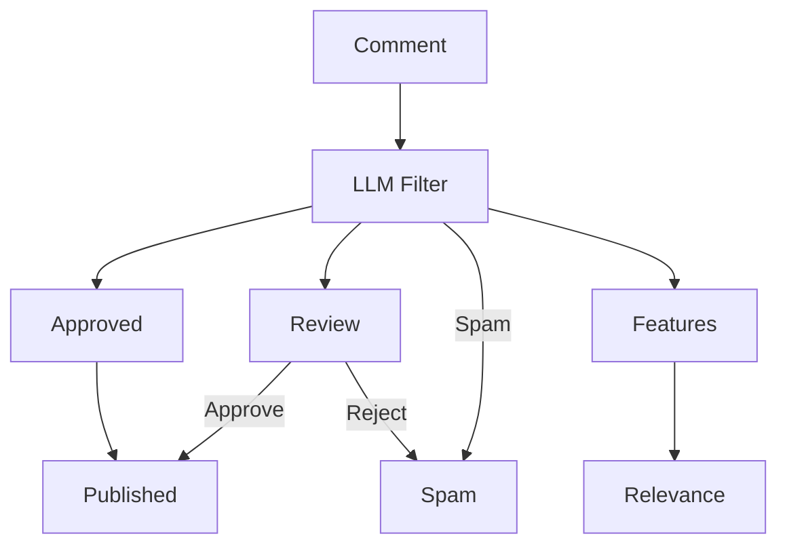
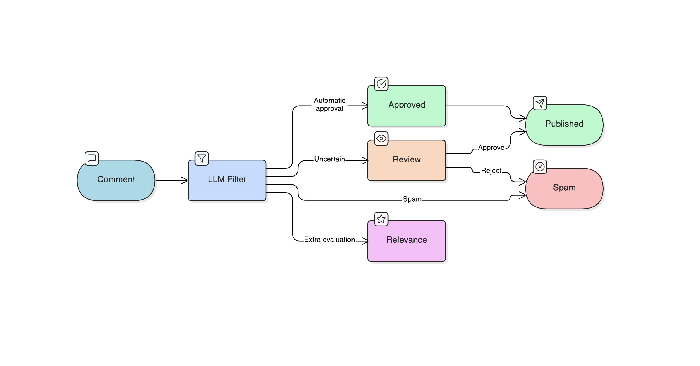

--- 
title: "Comment Filtering with LLM"
description: "Building an AI comment filtering, sorting and moderation system using Large Language Models for automatic approval, rejection, and review."
date: 2026-02-20
tags: [ai, web]
image: '22226.png'
---


User comments are essential for blogs, forums, e-commerce platforms, and social media websites, but managing them manually becomes cumbersome. Approving every comment requires continuous effort, while allowing all comments automatically often leads to spam, irrelevant discussions, or inappropriate content appearing under posts.

Today, large e-commerce and social media platforms already using AI-based systems to filter and rank user content automatically. This prioritize relevant discussions, suppress spam, and maintain content quality at scale. The same approach can now be implemented in smaller applications using Large Language Models (LLMs).

Instead of simple keyword filtering, an LLM understands context and relevance, allowing automatic approval of meaningful comments, flagging uncertain ones for review, and discarding inappropriate or spam content.



The above flowchart illustrates how an LLM-based moderation system can be used to automatically filter user comments. In addition to moderation decisions, we can also introduce a relevance feature that evaluates how useful or contextually related a comment is to the discussion.


## Implementation 

Here lets demonstrate a practical implementation of this comment filtering system using modern serverless tools.

The system uses the **Groq API** for fast LLM inference, **Cloudflare Workers** as the backend runtime, and a **Cloudflare D1 database** for storing comments and moderation results.
 
 

## D1 Database Design
The comment storage schema for the D1 database is intentionally minimal yet to make usable. The *approved* field now defaults to 2, which indicates that a comment requires review, to ensure that in cases where the LLM moderation API fails, no comment is automatically approved or rejected. The values are interpreted as 1 for automatically approved, 0 for spam or rejected, and 2 for pending review. Each comment is also associated with a *post_url*  to tie it to the specific page or post, and a *created_at*  timestamp.  

```sql
CREATE TABLE comments(
  id INTEGER PRIMARY KEY AUTOINCREMENT,
  uname TEXT NOT NULL,
  content TEXT NOT NULL,
  approved INTEGER NOT NULL DEFAULT 2,
  post_url TEXT,
  created_at TEXT
);
```


## Moderation Prompt 
For the comment moderation system, the Groq API is used with the **openai/gpt-oss-20b** LLM to evaluate user comments. Each comment is sent with a structured prompt, and the LLM returns a numeric moderation value. For simplicity, the prompt is short and minimal:

>"Classify comment safety. Reply ONLY with number: 1=approve, 0=reject, 2=unsure."

Although you can extend or refine it to include context awareness, tone detection, or additional instructions for more nuanced moderation.

## Cloudflare Worker Backend 
The Cloudflare Worker is our edge backend for the comment system, handling both fetching and submitting comments. 

```js
export default {
  async fetch(request, env) {

    const cors = {
      "Access-Control-Allow-Origin": "*",
      "Access-Control-Allow-Headers": "*",
      "Access-Control-Allow-Methods": "GET, POST, OPTIONS",
      "Content-Type": "application/json"
    };

    /* ---------------- CORS ---------------- */
    if (request.method === "OPTIONS") {
      return new Response(null, { headers: cors });
    }

    const url = new URL(request.url);

    /* ==============================
       GET → Fetch comments
    ============================== */
    if (request.method === "GET") {

      const post = url.searchParams.get("post");

      const { results } = await env.DB.prepare(`
        SELECT id, uname, content, created_at
        FROM comments
        WHERE approved = 1
        AND post_url = ?
        ORDER BY id DESC
      `)
      .bind(post)
      .all();

      return new Response(JSON.stringify(results), {
        headers: cors
      });
    }

    /* ==============================
       POST → Add comment
    ============================== */
    if (request.method === "POST") {

      try {
        const body = await request.json();

        const uname = body.uname?.trim();
        const content = body.content?.trim();
        const post_url = body.post_url;

        if (!uname || !content) {
          return new Response(
            JSON.stringify({ error: "Missing fields" }),
            { status: 400, headers: cors }
          );
        }

        /* ---------- IST DATE ---------- */
        const created_at =
          new Date().toLocaleString("en-IN", {
            timeZone: "Asia/Kolkata"
          });

        /* ==================================
           GROQ MODERATION
        ================================== */

        let approved = 2; // default unsure

        try {

          const groq = await fetch(
            "https://api.groq.com/openai/v1/chat/completions",
            {
              method: "POST",
              headers: {
                "Content-Type": "application/json",
                "Authorization": `Bearer ${env.GROQ_API_KEY}`
              },
              body: JSON.stringify({
                model: "openai/gpt-oss-20b",
                messages: [
                  {
                    role: "system",
                    content:
                      "Classify comment safety. Reply ONLY with number: 1=approve, 0=reject, 2=unsure."
                  },
                  {
                    role: "user",
                    content
                  }
                ]
              })
            }
          );

          const data = await groq.json();

          const result =
            data.choices?.[0]?.message?.content?.trim();

          if (["0", "1", "2"].includes(result)) {
            approved = Number(result);
          }

        } catch (e) {
          // if Groq fails → mark unsure
          approved = 2;
        }

        /* ---------- INSERT ---------- */
        await env.DB.prepare(`
          INSERT INTO comments
          (uname, content, approved, post_url, created_at)
          VALUES (?, ?, ?, ?, ?)
        `)
        .bind(
          uname,
          content,
          approved,
          post_url,
          created_at
        )
        .run();

        return new Response(
          JSON.stringify({
            success: true,
            moderation: approved
          }),
          { headers: cors }
        );

      } catch (e) {
        return new Response(
          JSON.stringify({
            error: "Insert failed",
            message: e.toString()
          }),
          { status: 500, headers: cors }
        );
      }
    }

    return new Response("Invalid request", {
      status: 405,
      headers: cors
    });
  }
};
```
{: file='worker.js'}

```toml
name = "<name>"
main = "<main_file>"
compatibility_date = "<compatibility_date>"

[[d1_databases]]
binding = "<db_binding>"
database_name = "<db_name>"
database_id = "<db_id>"
```
{: file='wrangler.toml'}


```html 
<input id="uname" placeholder="Name">
<textarea id="content" placeholder="Write comment"></textarea>
<button onclick="send()">Post</button> 
<div id="comments"></div>

<script> 
// Replace with your endpoint
const API = "<URL>";
const POST_URL = location.pathname; // Use page path as post identifier

//  LOAD COMMENTS 
async function load() {
  const res = await fetch(API + "/comments?post=" + encodeURIComponent(POST_URL));
  const data = await res.json();
  const box = document.getElementById("comments");
  box.innerHTML = "";
  
  // Loop through comments and display
  data.forEach(c => {
    const div = document.createElement("div");
    div.innerHTML = "<b>" + escapeHTML(c.uname) + "</b><div>" + c.created_at + "</div>" + escapeHTML(c.content);
    box.appendChild(div);
  });
}

// POST COMMENT 
async function send() {
  const uname = document.getElementById("uname").value.trim();
  const content = document.getElementById("content").value.trim();
  if (!uname || !content) return; // Do nothing if empty

  await fetch(API + "/comment", {
    method: "POST",
    headers: { "Content-Type": "application/json" },
    body: JSON.stringify({ uname, content, post_url: POST_URL })
  });

  document.getElementById("content").value = ""; // Clear textarea
  load(); // Reload comments
}

// XSS ESCAPE 
function escapeHTML(str) {
  return str.replace(/[&<>"']/g, m => ({
    "&": "&amp;",
    "<": "&lt;",
    ">": "&gt;",
    '"': "&quot;",
    "'": "&#039;"
  }[m]));
}

// Load comments on page load
load();
</script>
```

We are done setting up the LLM-powered comment filtering system. Below is a live demo implementation where you can interact with the system. You can post comments, see them appear instantly if approved, and observe how comments pending review or marked as spam are handled. Just give a try.

**Note on Relevance:** In this demo, the relevance scoring feature has not been implemented. To rank comments by relevance, you would need to assign a relevance value to each comment based on its content and context relative to other comments in the same batch or post. This typically requires comparing comment embeddings or analyzing semantic similarity with the post content. Once each comment has a relevance score, you can sort them accordingly to prioritize the most contextually meaningful or useful comments. Implementing this requires some additional logic and computation, so it has been left out of this minimal demo.


*LLM-based comment moderation pipeline showing automatic approval, human review for uncertain cases, spam rejection, and relevance evaluation used for ranking and prioritizing published comments.*

 

<style>div#note-section {
    display: none;
}</style>


This is the demo comment section—you can actually try it out here:


## Comments

<!-- new comment -->

<div class="ec-box">

  <input id="ec_uname" placeholder="Name">
  <br><br>

  <textarea id="ec_content"
    placeholder="Write comment"></textarea>

  <button onclick="ec_send()">Post</button>

</div>

<div id="ec_comments"></div>
<div id="ec_popup"></div>

<script>
(() => { 

const EC_API =
"https://edge-comments.mrinalcs-51b.workers.dev";

const EC_POST_URL = location.pathname;
 

function ec_popup(msg,type){

  const p=document.getElementById("ec_popup");

  p.className="";
  p.classList.add(type);

  p.textContent=msg;
  p.style.display="block";

  setTimeout(()=>{
    p.style.display="none";
  },3000);
}
 

async function ec_load(){

  const res = await fetch(
    EC_API + "/comments?post=" +
    encodeURIComponent(EC_POST_URL)
  );

  const data = await res.json();

  const box =
    document.getElementById("ec_comments");

  box.innerHTML="";

  data.forEach(c=>{
    box.innerHTML += `
      <div class="ec-comment">
        <b>${ec_escapeHTML(c.uname)}</b>

        <div class="ec-date">
          ${c.created_at}
        </div>

        <div class="ec-text">
          ${ec_escapeHTML(c.content)}
        </div>
      </div>`;
  });
}
 

window.ec_send = async function(){

  const uname =
    document.getElementById("ec_uname")
    .value.trim();

  const content =
    document.getElementById("ec_content")
    .value.trim();

  if(!uname || !content){
    ec_popup(
      "Write name and comment",
      "ec-popup-warn"
    );
    return;
  }

  const res = await fetch(
    EC_API + "/comment",
    {
      method:"POST",
      headers:{
        "Content-Type":"application/json"
      },
      body:JSON.stringify({
        uname,
        content,
        post_url:EC_POST_URL
      })
    }
  );

  const r = await res.json();

  if(!r.success){
    ec_popup(
      "Failed to post",
      "ec-popup-bad"
    );
    return;
  }

  if(r.moderation===1){
    ec_popup(
      "Comment posted",
      "ec-popup-ok"
    );
    ec_load();
  }
  else if(r.moderation===2){
    ec_popup(
      "Comment pending review",
      "ec-popup-warn"
    );
  }
  else{
    ec_popup(
      "Spam detected — rejected",
      "ec-popup-bad"
    );
  }

  document
    .getElementById("ec_content")
    .value="";
};
 

function ec_escapeHTML(str){
  return str.replace(/[&<>"']/g,
    m=>({
      "&":"&amp;",
      "<":"&lt;",
      ">":"&gt;",
      '"':"&quot;",
      "'":"&#039;"
    }[m]));
}
 

ec_load();

})();
</script>


<style>
h2#comments {
    padding-bottom: 20px;
} 

.ec-box input,
.ec-box textarea{
  width:100%;
  padding:8px;
  border:1px solid var(--h);
  border-radius:6px;
  font-size:14px;
  background:var(--b);
  box-sizing: border-box
}

.ec-box textarea{
  height:90px;
  resize:vertical;
}
 

.ec-box button{
  margin-top:8px;
  padding:7px 14px;
  border:none;
  background:var(--bt);
  color:var(--t);
  border-radius:6px;
  cursor:pointer;
}

.ec-box button:hover{
  opacity:.85;
}
 

.ec-comment{
  border-bottom:1px solid #eee;
  padding:12px 0;
}

.ec-date{
  font-size:12px;
  color:#777;
  margin:3px 0;
}

.ec-text{
  margin-top:4px;
}
 

#ec_popup{
  position:fixed;
  top:20px;
  left:50%;
  transform:translateX(-50%);
  padding:10px 16px;
  border-radius:6px;
  color:white;
  display:none;
  font-size:14px;
  z-index:9999;
}

.ec-popup-ok{ background:#2e7d32; }
.ec-popup-warn{ background:#ef6c00; }
.ec-popup-bad{ background:#c62828; }

</style>

<!-- end -->