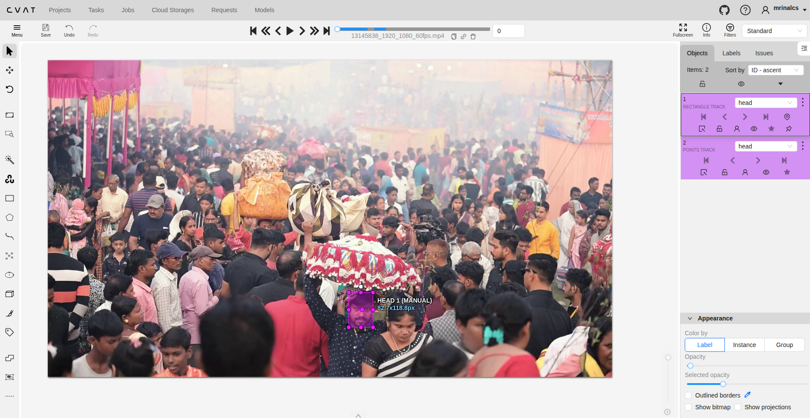
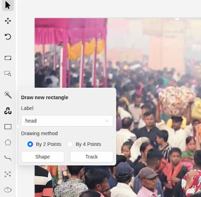
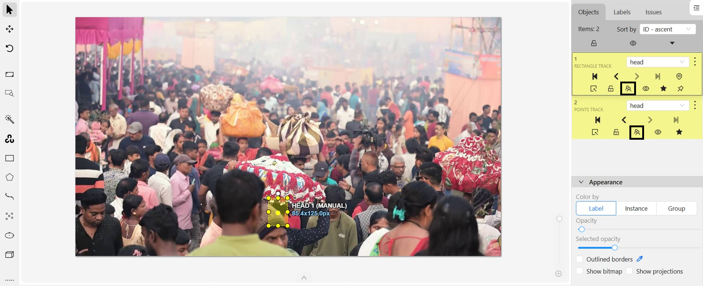

*CVAT: Video by Arijit Dey, [Pexels](https://www.pexels.com/video/vibrant-hindu-festival-with-crowds-and-rituals-30729612/)*

If you have spent a significant amount of time working with video datasets for **object detection and multi-object tracking**. One of the most common tools used in the industry for this purpose is **CVAT**. While CVAT provides powerful features for object tracking annotation, **incorrect ID assignment and ID switches** are frequent problems—especially in long videos, crowded scenes, or occlusion-heavy environments. This blog explains **how to annotate object tracking correctly in CVAT**, and more importantly, **how to fix mistakes when object IDs go wrong**.

---

## Understanding Object Tracking in CVAT

In CVAT, **object tracking** means assigning a **persistent ID** to the same object across multiple frames. Each tracked object is represented as a **track**, not individual independent annotations.
 
- **Track** → One object over time
- **Shape** → Bounding box / polygon / mask at a specific frame
- **Keyframe** → A frame where you manually adjust the object
- **Interpolation** → CVAT auto-generates shapes between keyframes

A correct tracking annotation ensures:
- One real-world object = **one unique ID**
- No ID switches
- No duplicated tracks for the same object

---

## Object Tracking Annotation

### Use Track Mode (Not Shape Mode)
For object tracking tasks in CVAT, annotations should always be created using Track mode rather than Shape mode. When annotating, first select the appropriate object type—such as a bounding box, polygon, or keypoint and then click “Track” instead of “Draw Shape.” Track mode ensures that CVAT automatically propagates the object across subsequent frames through interpolation, maintaining a single continuous track ID. This approach significantly reduces fragmented annotations, prevents accidental ID duplication, and minimizes tracking ID errors, especially in long or complex video sequences.

---
 

### Pause During Occlusion

When an object becomes fully occluded, it’s important to end the track at the last visible frame. You should only resume the same track if you are absolutely certain of the object’s identity after it reappears. If there is any doubt, start a new track instead. Never guess the identity after a long occlusion, as this can lead to ID switches.

## How to Correct Wrong Object IDs in CVAT
To correct wrong object IDs from the CVAT side panel, select the affected track from the Objects list and click the three-dot (⋮) menu next to it. From here, choose Propagate (or simply press Ctrl + B) to extend the selected track forward or backward across frames. This action copies the object’s position and attributes consistently, helping you restore continuity after fixing an ID switch or after manually correcting shapes at a keyframe. Propagation is especially useful once the correct object identity has been re-established, as it ensures the same track ID is applied consistently over the desired frame range without redrawing annotations frame by frame.
 

### ID Switch Between Two Tracks
   
**Scenario:** Object A becomes Object B after frame N.

An ID switch occurs when two tracked objects exchange identities after a certain frame, typically during close interactions, crossings, or crowded scenes. This is especially common in active learning pipelines where objects appear visually similar or move very close together. To correct this, identify the frame where the switch happens, manually fix the annotations, split the tracks if necessary, and propagate the correct IDs forward to maintain consistent identity assignment.
 

### Duplicate Tracks for Same Object

**Scenario:** Same object has two IDs across time.

Duplicate tracks occur when a single real-world object is assigned multiple IDs across time, often due to multiple detections or incorrect use of tracking mode. In such cases, the incorrect or shorter track should be deleted, and the correct track should be propagated across the missing frames to ensure that each object is represented by only one unique ID. 

 

### Wrong ID After Occlusion

**Scenario:** Object disappears and reappears but wrong ID is used.

A wrong ID after occlusion happens when an object disappears and reappears with a different identity. The object should be marked as occluded when visibility is lost, and identity should only be resumed if certainty exists. If an incorrect ID appears, remove the shorter or incorrect segment of the track and propagate the correct track across the remaining frames to preserve identity consistency.