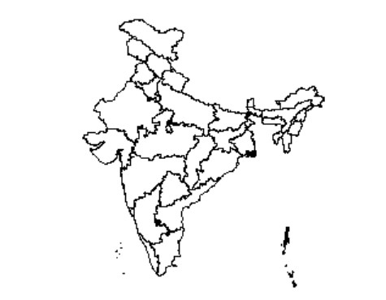
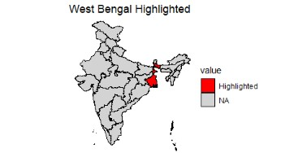

 

This is Part 2 of [Part 1](/mapping-india-in-r), which covered the challenges of obtaining an accurate map of India that follows the official government boundaries, including Jammu & Kashmir and Ladakh. The solution involved sourcing a reliable GeoJSON file and merging it with the data using the sf package. Although that approach works well, managing external spatial files and handling Coordinate Reference System (CRS) transformations adds extra complexity to the workflow.

The mapindia package provides a simpler alternative by handling these tasks internally.


**The mapindia Package**

The `mapindia` package (backed by the `mapindiatools` data container) is designed specifically to solve this problem. It provides ready-to-use, official boundaries for India’s states and districts right out of the box, and it is built to integrate seamlessly with `ggplot2`.

Because it borrows design philosophies from popular spatial packages like `usmap`, mapping demographics becomes a one-liner rather than a complex spatial join process.

## Installation

Install from `Tools > Install Packages > mapindia` or just run following r code.

```R
# Install mapindia
install.packages("mapindia")
```
  
## Usage

```R
library(mapindia)
plot_india()
```




```R
library(mapindia)
library(ggplot2)

# Create simple data
state_data <- data.frame(
  state = c("West Bengal"),
  value = c("Highlighted")
)

plot_india(
  data = state_data,
  regions = "states",
  values = "value"
) +
  scale_fill_manual(
    values = c("Highlighted" = "red"),
    na.value = "lightgrey"
  ) +
  labs(title = "West Bengal Highlighted") +
  theme_void()
```

