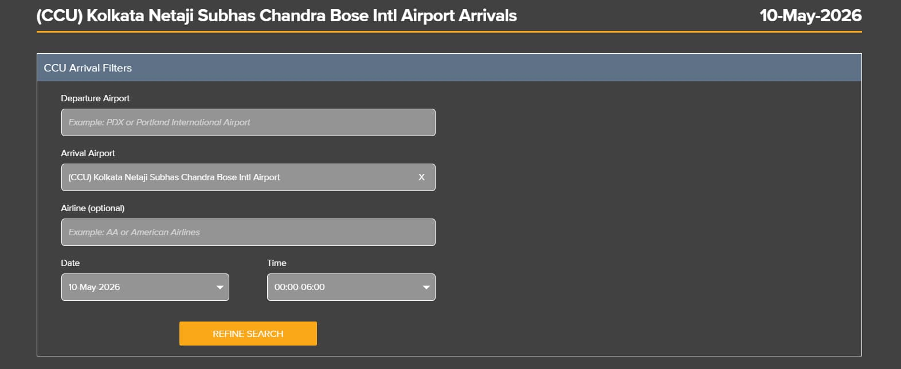
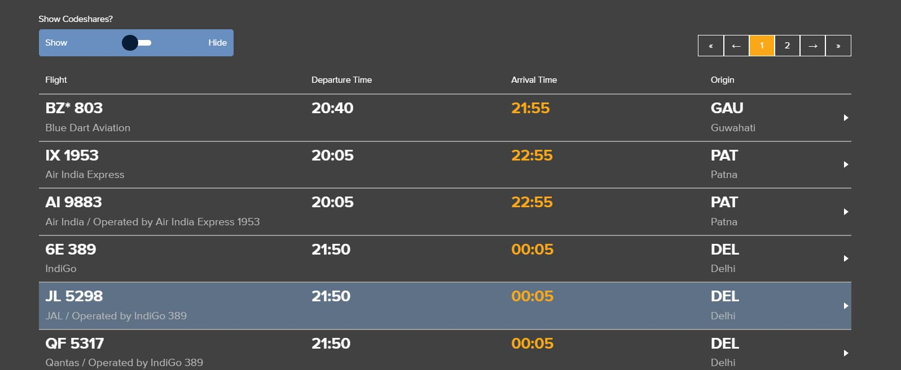

--- 
title: "Scraping FlightStats Airport Traffic Data" 
description: "Collect weekly airport arrival and departure data using Python from FlightStats."
date: 2026-05-10 
tags: [pandas,python,web,scraping]
---

Airport traffic data from FlightStats can be exports. Here We will specifically scrape data for Netaji Subhas Chandra Bose International Airport using the airport code CCU.
 

FlightStats airport schedule page displays arrival and departure schedules for a selected airport.  


 

FlightStats has api endpoints like:

```api
https://www.flightstats.com/v2/api-next/flight-tracker/{type}/{airport}/{year}/{month}/{day}/{hour}
```

| Parameter | Example | Description |
|---|---|---|
| `{type}` | `arr`, `dep` | Flight type (`arr` = arrivals, `dep` = departures) |
| `{airport}` | `CCU`, `DEL`, `BOM` | Airport IATA code |
| `{year}` | `2026` | Year |
| `{month}` | `4` | Month |
| `{day}` | `10` | Day |
| `{hour}` | `0`, `6`, `12`, `18` | 6-hour schedule block |


We’ll collect flights in 6-hour intervals to cover the entire day.


```python
# Scrap flightstats.com for Arrival

import requests
import pandas as pd
from datetime import datetime, timedelta
import json

BASE_URL = "https://www.flightstats.com/v2/api-next/flight-tracker/arr/CCU/{year}/{month}/{day}/{hour}"
HOURS = [0, 6, 12, 18]

start_date = datetime(2026, 4, 10)
end_date = datetime(2026, 4, 16)

all_flights = []
raw_json_store = []

current_date = start_date

while current_date <= end_date:
    year = current_date.year
    month = current_date.month
    day = current_date.day

    for hour in HOURS:
        url = BASE_URL.format(year=year, month=month, day=day, hour=hour)

        params = {
            "carrierCode": "",
            "numHours": 6
        }

        headers = {
            "User-Agent": "Mozilla/5.0"
        }

        try:
            response = requests.get(url, params=params, headers=headers)
            data = response.json()

            # store full raw JSON
            raw_json_store.append({
                "date": current_date.strftime("%Y-%m-%d"),
                "hour_block": hour,
                "response": data
            })

            flights = data.get("data", {}).get("flights", [])

            for f in flights:
                # Remove CodeShare Flights
                if f.get("isCodeshare"):
                    continue

                record = {
                    "date": current_date.strftime("%Y-%m-%d"),
                    "hour_block": hour,
                    "flight_number": f.get("carrier", {}).get("flightNumber"),
                    "airline": f.get("carrier", {}).get("name"),
                    "origin_city": f.get("airport", {}).get("city"),
                    "origin_airport_code": f.get("airport", {}).get("fs"),
                    "departure_time": f.get("departureTime", {}).get("time24"),
                    "arrival_time": f.get("arrivalTime", {}).get("time24"),
                }

                all_flights.append(record)

        except Exception as e:
            print(f"Error on {current_date} hour {hour}: {e}") # Error

    current_date += timedelta(days=1)

# Save as CSV
df = pd.DataFrame(all_flights)
df = df.drop_duplicates()
df.to_csv("ccu_arrivals_april10_16.csv", index=False)

## Save as Json
# with open("ccu_arrivals_april10_16.json", "w", encoding="utf-8") as f:
#    json.dump(raw_json_store, f, indent=2)
```


```output
>df.head()
date        | hour_block | flight_number | airline                | origin_city | origin_airport_code | departure_time | arrival_time
------------|-------------|----------------|-------------------------|--------------|---------------------|----------------|--------------
2026-04-10  | 0           | 803            | Blue Dart Aviation      | Guwahati     | GAU                 | 20:40          | 21:55
2026-04-10  | 0           | 389            | IndiGo                  | Delhi        | DEL                 | 21:50          | 00:05
2026-04-10  | 0           | 166            | Air Arabia Abu Dhabi    | Abu Dhabi    | AUH                 | 17:45          | 00:15
2026-04-10  | 0           | 2727           | Air India               | Delhi        | DEL                 | 22:00          | 00:20
2026-04-10  | 0           | 2257           | IndiGo                  | Hyderabad    | HYD                 | 22:15          | 00:25
```
 